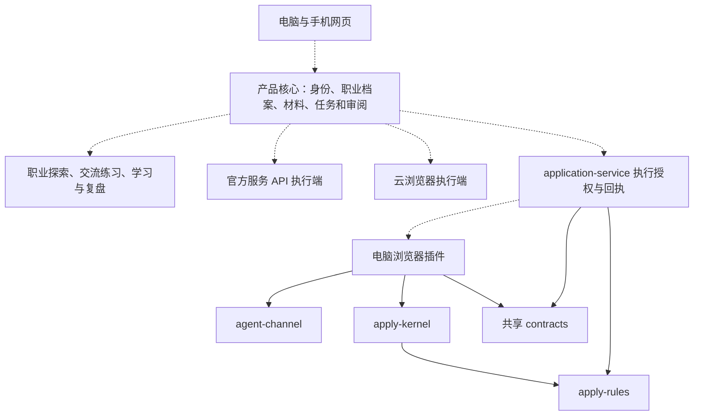

# 独立产品的架构与插件迁移

检查日期：2026-10-05。源仓均为私人仓；本次工作在本地进行，没有推送、部署或运行真实投递。

## 这次已完成与还未完成的部分

已把插件源码、测试、资产、执行内核、站点规则和通道完整迁入活跃 workspace；共享契约集中在一个包。后端相关源码及依赖闭包保留在 `imports/argoland`，便于以后提取，未启动旧 Nest/Prisma 应用。源数据、运行抓取池和环境文件不作为代码搬入；具体遗漏及来源 hash 有清单。

已抽出独立的 application-service：只读规则发布与健康检查，严格的签名/核验/digest 纯模块。**它还不是能让插件登录和投递的完整后端。**身份、用户档案、材料存储、任务租约、授权和回执事务需要以新产品的领域模型继续实现。

网页聊天、手机审阅、networking 和训练功能仍在产品设计阶段；现有 UI 预览使用虚构数据。

## 当前活跃目录

| 目录 | 职责 | 迁移状态 |
| --- | --- | --- |
| `apps/extension` | 浏览器权限、页面连接、用户界面与执行编排 | 完整迁入；本地默认、独立构建身份；禁旧发布任务 |
| `packages/contracts` | 当前插件与服务共享的类型、解析和协议 | 以插件当前版本为基线；不假装覆盖旧后端全部协议 |
| `packages/apply-kernel` | 页面识别、规则解释、填入与验证 | 原有内核复用；不依赖旧数据库或支付 |
| `packages/apply-rules` | ATS 规则与不可变 release | 一份源供内核和服务使用 |
| `packages/agent-channel` | 浏览器内部消息协议和握手 | 复用；保持不可信输入校验 |
| `services/application-service` | 规则发布、纯加密验证、未来执行业务的接入边界 | 可独立启动；执行与写入接口未开放 |
| `imports/` | 两个源仓的源码参考、来源清单与旧文档；包含旧网页插件桥接的依赖闭包 | 不参与 pnpm workspace，不继承原部署流程 |

暂保留 `@edaix/*` 包名和原 wire 常量，避免一次迁移同时改变编译路径、签名 audience 和浏览器协议；包名前缀不决定产品架构。

## 后续产品整体结构

下面是设计方向，虚线部分尚未实现。

核心保存“用户希望什么、批准什么、完成到哪里”；执行端负责“在获授权环境中具体做什么、怎样验证”。未来云浏览器可以补充插件，不需要把用户档案或整个产品 UI 重写一次。

## 发现的架构问题

**双仓接口漂移。**同名文件除了 import 后缀和注释差异，还存在语义不同：后端 application-form/V3 与当前插件 V1/V2 执行链，资料投影中的工作授权等。当前服务只移植经共同类型支持的验证子集；原后端参考文件保持原样。以后新增协议应由共享包定义，再由两端同时实现与验证。

**旧宿主耦合。**后端 execution/extension 模块依赖 mission、application、auth、profile、resume、quota 和 Prisma。整个模块搬到 services 并不能独立运行。新服务先提取纯功能，后续通过身份、档案、附件、租约与回执 ports 接入新产品，避免继续把支付和门户当作执行依赖。

**插件控制器过大。**旧 `dock.ts` 约 4200 行，`apply.content.ts` 约 3400 行，background 约 1700 行。拆包完成了运行环境的分离，尚未解决这些文件内部的耦合。应逐步把会话、任务恢复、页面观测、授权、执行及显示投影拆开，用现有行为测试约束；不在没有端到端证据时同时改写所有执行逻辑。

**队列恢复不完整。**任务队列的关键 Map 仍在 service worker 内存；少量持久化不等同于完整恢复。批量任务上线前要明确中断、过期、取消、重试和未知提交结果。详见[审阅队列评估](review-queue-assessment.md)。

**旧默认环境不适合新产品。**已把普通 build/dev 设为 localhost，默认关闭写入、runtime bundle 和遥测；未配置的生产位置使用 `.invalid`，旧发布命令停用。生成新的开发用 Chrome 公钥身份，不沿用原扩展 ID。公钥只用于稳定开发 ID，不是执行签名密钥。

## UI 调整难不难

现代 assistant 的 React 部分已有清楚边界：`design/` 负责视觉变量，`scenes/` 和 `shell/` 负责布局，`features/` 是交互流程，`ports/` 隔开具体服务。它有独立 Vite 预览，可切换虚构用户、场景和故障状态，修改布局、颜色、文案或增加职业探索场景时，不必加载插件或连接原后端。

实际检查了桌面与 390px 手机宽度的欢迎及资料对话预览。页面能显示；这证明现有界面具备响应式基础，不证明手机插件可用，也不是完整手机验收。旧品牌和演示角色暂保留，产品名确定后再统一调整。

难度较大的是改旧 dock 并同时影响真实页面执行，以及把新手机审阅接入真实身份、材料和授权。建议新产品网页使用共享的纯 UI 与领域状态，浏览器能力留在适配器中；不要把含 Chrome API 的旧 dock 直接变成主网页。

UI 构建还提示两个较大的 chunk：共享界面约 635KB，延迟加载的船动画约 522KB。上线手机体验前可删减演示资产、拆分场景并按需加载；目前不宣称已做性能优化。

## 公开仓库的实际待办

源后端 package 标为 `UNLICENSED`，新项目尚未指定许可证；源图标、人物画像等资产也需要明确可公开使用的来源。应先确认哪些源代码属于你可公开的范围，再选择新项目许可及替换必要资产。当前静态检查未发现环境文件或常见真实 key 格式，但这不等于来源内容已经完整审计。

因此本次交付的是独立的本地迁移与验证，不是公开仓库或可上线求职服务。代码测试通过也不能证明真实网站投递成功率。
