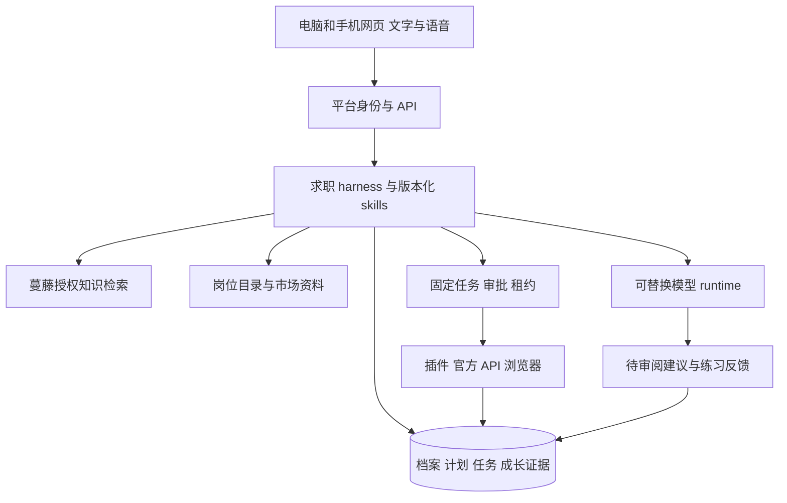

# 求职 Agent 基础架构

> 历史参考：本文已被 [docs/product/](../product/README.md) 取代，不再作为当前产品或实施决策。以下保留当时的领域方案与讨论；当前定位、流程、分期和边界以权威产品文档为准。
>
> 产品不做个人签证或工作资格判断，相关问题交给学校 DSO 或雇主核实。

求职伙伴在现有网页底座上增加职业领域层。蔓藤提供的流程判断、课程和咨询经验，先整理成有输入条件、评价标准、版本和出处的 playbook。模型承担理解、解释和演练；产品维护长期计划、权限与成果依据。用户已确定第一次15分钟的结果：比较两个职业方向，并确定一个验证行动。课程项目作为输入和证据，后续再形成可解释案例、练习与真实行动。

## 我们需要拥有的 harness

harness 是管理 agent 工作过程的运行层。我们要拥有求职领域的规则、数据和状态，复用成熟 SDK 的模型循环。模型 SDK、聊天组件、知识库和业务系统负责不同事情。

| 层 | 职责 | 当前决定 |
| --- | --- | --- |
| 交互 | 文字、语音、卡片、计划审阅 | 保留现有 React 网页，电脑与手机共享账号和数据 |
| 求职领域 | 档案、方向、项目、练习、投递与证据 | 新增独立 career-core，模型和旧门户不进入此包 |
| 工作过程 | skill 选择、固定输入版本、审批、停止和恢复 | 延续平台身份、PostgreSQL 状态、任务租约与 checkpoint |
| 模型循环 | 理解请求、结构化输出、提出工具调用 | 现有 ai-core 保留，SDK 通过 adapter 评估接入 |
| 知识与岗位 | 文档检索、内部只读服务、岗位目录与市场统计 | 每类提供窄 port，返回来源和观察时间 |
| 执行 | 官方 API、插件、浏览器与隔离 CLI | 按任务选择执行端，登录和最终提交继续由用户参与 |

[AI SDK](https://ai-sdk.dev/docs/agents/overview) 提供模型与工具循环，[useChat](https://ai-sdk.dev/docs/ai-sdk-ui/chatbot) 管理流式聊天界面。[OpenAI Agents SDK](https://developers.openai.com/api/docs/guides/agents/sdk) 让应用拥有服务、存储和审批，由 SDK 运行 agent 循环。[ChatKit](https://developers.openai.com/api/docs/guides/chatkit) 可嵌入聊天组件并连接自己的后端。它们都不会替产品定义职业计划、整理蔓藤内容或核实求职成果。

现有 ai-core 已有受限工具循环，API 已有账号、私有成果、审批、outbox 和 worker。第一版在这些接口上增加求职工具，不为了得到一个 SDK 名称重写底座。以后如果维护循环成本上升，优先评估 TypeScript AI SDK 或 Agents SDK adapter；若分支与长期中断变复杂，再评估 [LangGraph persistence](https://docs.langchain.com/oss/javascript/langgraph/persistence)。领域档案仍单独存储，不把一个 graph 的聊天状态当作完整职业档案。以上是本项目架构选择；没有安装或验收这些 SDK。

## 七个初始 skills

每个 skill 都有目标、所需资料、可用工具、产物、审阅标准和停止条件。它是可测试的业务流程，不能只是一段鼓励模型多做事的提示词。将来可映射为 SDK tools 或 skills，真实权限继续由 API 控制。

| Skill | 给用户的结果 | 关键评价 |
| --- | --- | --- |
| 了解经历与限制 | 可纠正档案与一个下一步 | 允许未知，事实与推断分开 |
| 探索职业方向 | 少量方向比较与验证行动 | 真实工作任务和岗位来源支持判断 |
| 把课程项目讲清楚 | 事实清单、故事和追问 | 本人贡献能解释，课程标签保留 |
| 完成小项目 | 限定时间的交付与评阅计划 | 每个交付对应一个岗位任务 |
| 练习职业交流 | 情境、消息草稿和下一次改进 | 减少提示后也能完成开场与追问 |
| 准备一次投递 | 固定岗位、材料、缺失项和审阅 | 材料准备不自动记为已投递 |
| 练习面试并复盘 | 追问、评价和下一次练习 | AI 反馈不直接证明掌握技能 |

当前代码位于 `packages/career-core`。准备函数仅生成 draft plan；它没有连接模型、创建任务、读邮箱或提交表格。缺少岗位/知识来源、资料版本变化或连接未建立会返回具体缺口。代码的运行上下文必须来自认证后的服务器，不接受客户端声明自己的工具权限。

## 蔓藤内容如何成为产品能力

用户确认资料目前分散在文档、课程、案例、数据库和内部网站。先列内容目录及使用权限，选择一条可授权、可匿名的完整流程，例如商业类大学生如何从课程项目探索暑期实习。每条流程记录适用人群、触发条件、步骤、判断依据、案例、评价标准、内容负责人、更新时间和升级到导师的条件。

文档入口负责解析与分段，数据库入口通过限定只读 API 提供必要字段；两者进入统一的知识来源记录。检索前依据用户和内容授权过滤，结果带原始来源、版本、段落和更新时间。第一轮可以从少量全文搜索开始，验证召回不足后增加向量或混合检索。只有被用户选择或当前流程确有必要的个人资料进入模型上下文。

“背书”可说明内容由谁提供；效果需要单独验证。内部案例经过匿名化和内容使用确认后才能成为产品资料。尚未获取实际资料，当前知识 port 不返回假内容。[数据接入方案](data-integrations.md) 说明两类入口与核验要求。

## 一套成长证据贯穿全部功能

建议的数据实体是 CareerProfile、RoleHypothesis、ProjectEvidence、SkillAssessment、Plan、CareerTask、ApplicationRecord、KnowledgeSource 和 ConnectorAccount。项目映射技能，技能映射岗位任务，计划安排下一次交付，评阅结果决定后续行动。私人文件保存为引用；证据记录保存来源和确认状态。

任务状态需要区分 planned、in_progress、awaiting_review、completed、needs_revision 与 cancelled。只有可审阅产物和满足标准的回执才能完成任务；聊天说“做完了”只产生待确认信息。用户改变方向或课程安排后，重新准备受影响的计划，保留旧版本以便解释变化。

`careerProgress` 的首版规则已实现：同一申请的重复邮件或导入按稳定 subject 去重，撤回/否定盖过旧观察，其他账号证据不能计入。已观察与本人报告先记 provisional；有引用的用户确认可形成项目、外联、投递和面试里程。导师评阅可形成简历/练习已评阅里程，它不表示能力达标或已经提升。真实保存服务必须核验确认者、评阅者和证据引用，不能信任模型填写的 verification 字段。完成练习的活动记录与独立评阅质量分开，让暂时找不到导师的人也能前进。

不会以生成多少份简历或海投多少次替代成果。产品同时显示过程与结果：已经完成哪些合理行动，留下哪些能解释的作品，哪些岗位差距得到验证，收到哪些真实回复或邀请。学习提升需要同一评价标准下的可比较任务和再次练习，不展示未经校准的“技能提升 37%”或“面试概率 82%”。

## MCP 与执行端

[MCP](https://developers.openai.com/api/docs/guides/tools-connectors-mcp) 提供工具协议；真实第三方连接仍需要应用注册、每用户 OAuth、权限管理、撤销、结果保存和安全隔离。用户在 Codex 中连接 Gmail，不会自动把授权转给我们的产品。内部知识库也可封装为 MCP，但第一版可以用普通只读 API；协议名称不影响内容质量。

网页首先服务用户的理解、陪伴、计划和审阅。插件使用用户当前浏览器的页面与登录状态，适合辅助填写；云浏览器是另一个独立会话，需要服务器算力、登录处理与运行成本。模型推理可在云端，浏览器操作可在本机；二者无须位于同一台机器。电脑浏览器扩展不自动成为手机执行能力。现有插件还未完成新身份、档案、授权、租约和回执桥接。[旧模块审计](reuse-audit.md) 给出具体复用边界。

## 从网页开始的实施顺序

1. 保存可纠正的职业档案与真实项目事实。先支持专业、年级、课程、时间预算、偏好、项目贡献和用户主动提供的限制。
2. 接一条蔓藤知识流程与少量有来源的岗位。输出两三个职业假设和每个假设的验证行动，用户选择后才成为当前计划。
3. 围绕一个岗位任务做项目表达、微型项目或交流练习，保留作品与可比较反馈。课程安排、暑期目标和每周可用时间共同约束任务，不把所有学生塞进同一课程列表。
4. 使用 job-radar 形成独立岗位目录，先复用 ATS、更新事件和扫描记录，再做查询、去重和失效检查。岗位契合度显示证据、缺口与未知；不把模型分数当筛选真相。
5. 接真实 Gmail/OAuth，先识别待确认线索；接插件到同一任务系统，帮助准备材料与填写。外联发送、登录、验证码、敏感字段和最终提交保留独立授权或用户参与。
6. 结合真实反馈更新计划并推出成就界面。用户重复使用证明需求后，再决定 CLI、原生桌面端和实时语音投入。

文本和语音共用领域计划、资料与 skill 版本。转写结果先给用户检查；语音里说“投吧”不等于插件收到可信最终点击。当前本地转写与英文朗读是独立服务，完整实时通话、求职运行层、岗位查询与知识导入仍需继续接入。

## 第一次产品验证

以一个真实课程项目开始，恢复背景、资料、本人贡献和一个判断；对遗忘处保留问题。得到一段能回答追问的项目表达，比较两个岗位方向，再安排一个本人愿意完成的小验证任务。针对创始人的 IBM business strategy 项目，这一过程比立刻填写全部履历或生成长篇职业报告更容易检验价值。

首轮关注用户能否说明为什么探索某个方向、能否更独立地回答一个追问、是否完成下一次行动，以及实际反馈是否改变计划。模型答案好看、系统聊天很久、插件填了很多字段均不足以证明这条路径有效。

官方接口资料核实日期为 2026 年 10 月 6 日。产品流程、实施顺序和能力判断为本项目设计，效果需用真实用户反馈验证。
