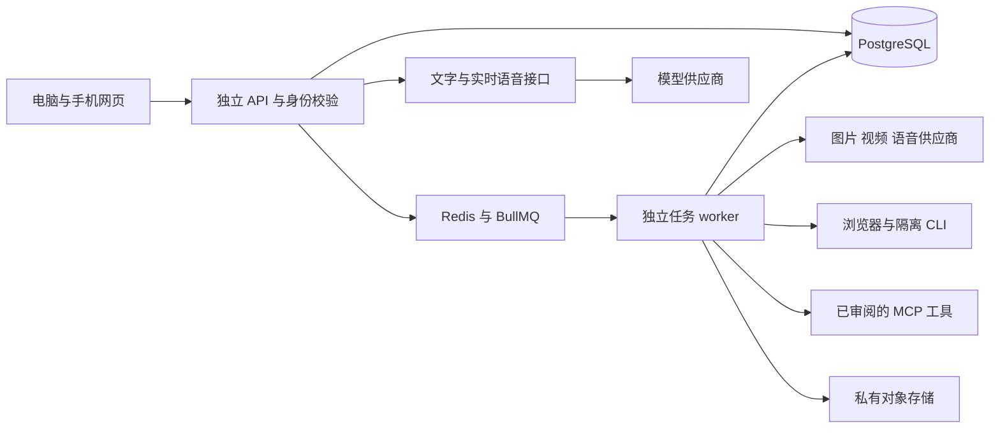

# 通用 AI 工作台架构

通过统一后端接入模型，先用本机已有模型验证文字与 Agent，再用商业 API 验证需要的产品质量；后续根据用户、成本和工作流决定是否自部署。当前网页和服务独立于旧 Argoland：同一账号保存对话、明确选择的记忆、附件、任务、审批和生成成果；模型与执行器可以替换。不能据此推断 Higgsfield、ChatGPT 或 Updream 的内部数据库与服务器选型。

## 代码分工

| 位置 | 职责 |
| --- | --- |
| apps/web | React 网页、手机布局、语音录制与 WebRTC、任务和审批界面 |
| packages/platform-contracts | 账号、消息、任务、供应商、产物和 runtime 共享接口 |
| packages/ai-core | 供应商协议、流式工具循环、媒体任务、浏览器和 CLI 执行器 |
| packages/career-core | 七个版本化求职 skill、资料准备条件、来源 ports 和成长证据规则；尚未挂入求职 API/runtime |
| services/platform-api | 身份、邮箱验证与密码找回、所有者校验、私有文件、消息保存、审批、用量、任务与邮件 worker |
| 私有知识来源 | PostgreSQL 保存原文、版本和分段；网页管理资料，Agent 按账号检索与读取有来源的段落 |
| MCP 外部工具 | 服务器审阅目录、账号 grant、固定定义审批、开始回执及私有结果；默认未配置，没有真实 OAuth |
| services/local-speech | 独立 Python／Kokoro CPU 语音服务；显式准备固定资产，运行时不下载模型 |
| services/local-transcription | 独立 Python／Faster Whisper CPU 转写；固定 tiny 与本地 VAD，20 MiB／120秒限制 |
| infra/platform | 独立本地 PostgreSQL、Redis，及可选 SeaweedFS 开发对象存储 |
| apps/extension 等原包 | 迁入的求职填写执行端，尚未与新平台身份和任务接口连接 |
| imports | 带来源记录的历史参考，不运行或部署 |

PostgreSQL 是任务状态的依据，Redis 负责分发任务。创建任务和写入 outbox 在同一数据库事务里；worker 领取租约，记录每次尝试，在保存结果前再次检查任务和租约。已有供应商任务 ID 的 Ark、fal 和 ComfyUI 任务可以继续查询；没有可确认的外部结果时保留 `uncertain`，不盲目重复付费请求。取消会停止本平台继续发布结果，但不能保证撤销供应商已经执行的操作。

Agent 在聊天中准备任务时，同一事务保存 [原对话与 assistant 消息的关联](conversation-tasks.md)。关联由服务器固定并验证活跃聊天租约，恢复页面只读取当前任务状态、当前授权版本和该版本的待审批记录。结果通过专用私人读取通道带回本对话引用草稿，由用户发送后继续。删除对话只移除关联，独立任务仍在任务中心。

[目标计划](goal-plans.md) 另存原会话的目标、冻结步骤与精确回执，支持明确逐步准备现有任务及只读分析。Agent 可以读取有界的执行配置并提出一份待审阅草稿，原聊天按服务器记录恢复其当前摘要；来源由活跃聊天闭包固定，一条回复内重试不重复保存或覆盖用户编辑。每个外部任务仍独立审批，分析由用户明确运行；它不是后台自动协调器，也没有序列化供应商的模型调用栈。后续图片／视频／朗读／CLI任务可明确绑定更早的完整分析或文字成果，图片／视频另可绑定精确私人参考图；准备时原子保存实际输入与来源快照，审批和执行核对绑定图片字节。任意外部参数映射与按授权策略持续运行仍待实现。

## 模型与执行能力

| 能力 | 接入代码 | 当前验证与限制 |
| --- | --- | --- |
| 文字、陪伴、工具 Agent | OpenAI Responses；OpenRouter、Ollama、Ark 兼容接口 | Ollama／Qwen 本地真实文字与工具调用已通过；商业接口仍为协议 fixture，商业账户实调用待验证。工具受 API 身份和任务权限控制 |
| 图片与参考图编辑 | OpenAI Images；fal；ComfyUI | 本地协议测试；模型权限和实际成果待验证 |
| 视频 | Ark Seedance；fal；ComfyUI | 持久化任务 ID、轮询、成果转存和恢复。Ark、fal 可在请求中直接交付私有参考图片；实际模型权限、图片规格及生成质量待账号实测 |
| 语音 | 本地 Kokoro 英文 TTS、Faster Whisper ASR；OpenAI 转写、TTS、Realtime WebRTC；ElevenLabs TTS | 逐回合交流已连接转写、审阅、会话回答与私人朗读。ElevenLabs 已贯通直接朗读、任务及持久工作流，固定服务端模型／声线、MP3与取消；不上传录音或训练声线，也不提供其 ASR／Realtime。商业账户、本人训练、真人听感、实时通话与真实麦克风仍待实测 |
| 浏览器 | 独立 Playwright context；明确操作计划与逐步回执 | 读取公共 HTTPS 页面；可选的点击、文本填写、下拉选择与滚动需单独启用和批准。没有登录、验证码、敏感字段或最终提交；验证范围见记录 |
| CLI harness | 固定版本官方 Codex 镜像；worker 的 Responses relay | 实际 Docker 与官方 Codex 在断网容器内写出虚构代码文件。模型响应由测试 fixture 提供；商业模型质量与费用待验证。默认保留内部 sandbox，显式外层隔离模式另见执行器说明 |
| 工作流 | 最多 8 个明确的文字、图片、视频或语音步骤 | 私有模板、固定执行计划、逐步成果保存及图片引用。已完成步骤不重做；已保存的异步任务继续查询；没有确认结果的步骤等待审阅 |
| 插件投递 | 原扩展保留 | 新平台身份、档案、授权、租约和回执的桥接仍待设计；不后台提交申请 |

供应商密钥仅在服务器环境中。界面如实展示是否配置和启用，不把固定回复当成模型。OpenAI 语音向浏览器下发短期会话凭据，长期 API key 不进入网页。商业调用默认关闭；测试使用虚构资料和本地协议服务。开源模型部署需要单独评估许可、推理资源和运维；请求不会自动下载权重。

知识来源由用户在网页中明确保存；存资料不调用模型。Agent 的 `search_knowledge` 和 `read_knowledge_passage` 在检索前按认证账号过滤，返回真实段落、当前版本和来源信息；修改后的旧引用拒绝读取。来源链接不自动抓取，内容标为 `untrusted_knowledge`，不能改变工具权限或授予新行动。当前实现是有界的私有词汇检索，尚无蔓藤组织知识同步、向量检索或职业档案工具；详见 [知识接入](../career/data-integrations.md)。

本次预览显式使用 `http://127.0.0.1:11434/v1` 的已安装 `qwen2.5:7b`，商业开关仍为0。实际 `/api/status` 确认该 Ollama 实例 `cloud.disabled=true`；这属于本机状态，不能推广到任意 Ollama 实例。平台环境里的开关不会改变另一个已运行 Ollama 服务的云设置。Ollama 接入阶段没有下载或修改其权重；本地接入成功也不证明内容质量或上线吞吐能力。

Kokoro 的准备命令单独下载锁定版本的权重、英文音色与 G2P 资产，校验 SHA256 后写入忽略的本地目录。HTTP supervisor 与模型子进程分开：单请求、无等待队列；客户端断连或超时会收回并等待该子进程退出，再重新加载。清理无法确认时停止接收生成并要求重启。子进程不继承供应商密钥，导入模型库前关闭常见 Python socket 连接与 DNS；这属于 Python 运行时边界，不是 OS 网络沙箱。平台 API 保留身份、租约及私有 WAV 保存，网页不直接访问语音服务；文字用量账本不统计 TTS 费用。当前仅开放 `kokoro-82m`／`af_heart` 美式英语朗读；Linux CPU 依赖已锁定，远端开发实例的真实 Kokoro→Whisper 往返已验证，多用户吞吐和一般音质仍未验收。详见 [本地语音服务](../../services/local-speech/README.md) 和 [运行验证](verification.md)。

ElevenLabs adapter 只开放服务器明确绑定的 `eleven_v4`、`eleven_v3`、`eleven_multilingual_v2` 或 `eleven_flash_v2_5` 的单声线 HTTP TTS。音频为受大小和签名检查的 MP3；任务、工作流使用同一实现和取消边界，不在失败后换模型、声线、供应商或保留策略。当前声线是服务端审阅的产品共享配置，没有个人声线注册授权、录音上传或训练功能；账号可用性、本人训练是否完成和真人听感不能由配置状态推断。提供历史保留默认关闭，此模式的供应商账号条件仍须实测；详见 [adapter 边界](../../packages/ai-core/README.md#elevenlabs-and-a-configured-custom-voice)。

创作页可以将已保存的私有图片带入下一轮图片修改或图片生成视频草稿，也可以选择工作流中已保存的图片成果。参考图显示预览、来源和顺序；最多四张 PNG、JPEG 或 WebP，总计20 MiB。服务端公开每种能力的参考输入支持，网页不会把 ComfyUI 等未提供该绑定的服务当成可编辑图片服务。选择作品只准备草稿，不创建任务或调用模型；完整审阅固定描述、服务、模型、参数及图片，用户确认后才创建新的创作任务，原作品保留。

`GET /artifacts/:id/reference-attachment` 将当前账号的作品解析为已有附件 ID，同时核对作品、上传和来源任务的所有者、大小及文件签名。该接口不复制文件，不产生公开链接。新任务仍通过已有私有附件读取通道向供应商交付字节。Agent 的 `get_artifact_reference` 使用同一核验，`create_job` 可以引用这些附件；读取作品不构成新的创作授权。图片／视频遵循现有明确创建请求与商业调用开关，浏览器、CLI 和工作流继续使用任务审批。

CLI、工作流和创作任务的文字成果可追加到Agent草稿，保留原有未发送文字及附件。按钮只携带任务／成果来源引用；发送后 `read_artifact_text` 与 `GET /artifacts/:id/text` 共用私有读取核验。允许四种文本MIME，整源最多1MiB，每次通过固定版本流读取并严格校验完整UTF-8，返回默认12KiB、最多16KiB的分页。后续字节偏移必须使用返回的UTF-8边界和同一强版本，文件变化时拒绝混合。结果标记 `untrusted_artifact`，不构成新任务授权，也不执行代码。界面按callId更新工具状态；已返回表示收到结果，任务完成由实际任务状态决定。来源文件名也属于未可信资料。

供应商的选项分别处理：OpenAI 图片编辑使用图片字节，Ark 使用首帧／首尾帧／参考图用途，fal 使用模型支持的单图或多图输入字段。fal 的模型参数放在 `input`，ComfyUI 使用服务器模板；界面不向这些服务附加其无法解释的通用画幅与时长。文件签名检查不代替完整图片解码，也不能证明账号可用或生成质量。

浏览器计划固定目标、URL 和最多十二个操作。目标按可见角色或标签与名称定位，必须唯一；任意脚本、CSS 选择器、坐标和键盘命令不在输入契约中。实际控件还要通过检查：可点击普通链接与显式 `type=button` 按钮，可填写普通文本／搜索框或 textarea，可选择原生 select。登录、验证码、敏感资料、条款、付款和提交控件被拒绝。定位方式依据 [Playwright 官方 locators 文档](https://playwright.dev/docs/locators)。

执行前后检查当前所有者、审批、任务代次和有效租约。每一步先保存开始记录，操作后将可见文字、表单遮罩截图与结构化观测存入私有存储，回执确认后才开始下一步。浏览器上下文是临时的；任何操作已开始后遇到取消、中断或无法确认结果，都需要人工核对，普通重试不会从新页面重复整条操作计划。已有部分成果仍可查看，服务器没有提供绕过核对的解除接口。

网页正文和控件描述标记为 `untrusted_page`，Agent 可通过所有者校验读取已有任务观测，不必重新访问网页。网页内容不能授权新操作。界面的“带回 Agent 草稿”只放入任务引用，不自动发送；用户发送后，Agent 才能在对话中读取该账号的结果。

所有浏览器请求仍限 GET／HEAD，保留公开地址检查、DNS 与连接绑定、重定向检查、无登录 cookie 和独立上下文；明确列出的 loopback 地址仅用于本地虚构 fixture。点击及填写可能触发不受信任页面的 JavaScript，GET 请求也可能产生远端副作用，因此这组限制不等于全面的只读保证。默认关闭交互开关；当前没有完整的电脑控制、账户登录会话、任意网站操作或提交能力。

CLI 容器保持 `network=none`，由受信任 wrapper 通过 Docker 标准输入输出传递模型请求；只有领取任务的 worker 可以调用模型。代理逐次检查账号、审批、代次和租约，固定审批时的模型与额度，并记录请求预留及实际 token 计数。密钥不进入容器，没有可供网页或 shell 调用的公共代理路由。模型的上下文会送至供应商；代理不保存请求正文。未完成结算和不确定结果需要审阅，重试不能重置任务额度。当前只有 CLI 有这组代理额度，其他能力的计费和全平台配额仍未完成。

语音记录独立于普通聊天消息，仅保存用户明确选择的摘录。浏览器收到的最终转写事件不能作为服务器已核实的对话；界面标明来源，不自动加入模型上下文。带回草稿后由用户决定是否发送。WebRTC 的输入转写模型与文件转写模型分别配置；不兼容的模型会被拒绝，不用缺失转写伪造用户发言。

临时语音练习草稿在当前账号认证代次和会话的内存状态中保留，切到聊天或其他页面后可以回来继续。同模式聊天导航保留当前会话，选择其他会话使用另一份草稿；首次保存创建会话时，原稿和保存UUID绑定到新会话。退出、重新认证或刷新页面会清空，删除会话也会清除其稿。最多保留32份草稿，不静默淘汰未保存内容；容量不足提供可恢复提示。完整文字最多8,000字，实时片段合计500记录／1MiB，朗读文本最多4,000字。它不保存麦克风连接、RTC、短期令牌、原始事件或录音Blob；离页会释放资源并拒绝旧页面的延迟转写回写，尚未转写的音频无法恢复。内存草稿不等于服务器历史，保存历史仍需明确点击。

三种语音角色由口语化对话指令、服务支持的朗读表达和实时接话偏好组成。`ProviderStatus.voiceOptions` 分别声明 TTS／Realtime 的声线和能力；未知能力不发送自定义参数。已知 `gpt-4o-mini-tts` 模型与两个固定快照允许最多2,000字表达指令，旧 `tts-1`／`tts-1-hd` 和当前 Kokoro 不允许；TTS 与 Realtime 使用各自声线列表。实时接话映射到 `semantic_vad` 的 low／medium／high。忙碌和实时连接期间控件锁定。每轮回答固定发送时的角色，音频标记实际请求的声线与表达；Kokoro 标为服务默认表达。角色与声音配置仅在账号／会话内存草稿保存，没有新增历史持久化字段，刷新后的历史不恢复这些标签。

浏览器录音由独立 `BrowserVoiceRecording` 控制器管理，不把录音器事件留在页面组件中。它通过 `MediaRecorder.isTypeSupported` 选择可转写的 WebM、MP4 或 OGG 容器，按实际录音器／数据块的 MIME 验证，不猜测空 MIME。只有点击结束才将完整录音交给转写；录音错误、轨道意外结束、取消和过期编辑器会释放资源并丢弃音频。20 MiB 限制包含结束时的最后数据块。页面提供取消按钮及 HTTPS、权限、设备和格式的恢复提示。OGG／FLAC 导入已贯通后端扩展名与精确容器头校验，实际解码仍由转写服务负责；通用私人文件下载保持附件方式。MP4 选择和失败生命周期已通过注入测试；合成 WebAudio 流已通过真实 Chrome 录制及远端 Whisper 转写，这不代表真实手机或真人麦克风验收。

实时会话创建请求携带取消信号；客户端停止或离页会取消创建，忽略取消的晚返回会话仍尝试释放租约。服务端检查断连、将信号传入供应商请求，并在晚完成或失败时释放已取得的租约，已持久化的会话标记释放。调用尝试计数保留。HTTP取消和本地租约释放不能保证撤销供应商已签发凭据或退款；最后响应交付的竞态仍受租约到期与供应商凭据期限约束。

“已配置”表示服务器具备所需配置并允许请求，不等同于账户实测通过。文字、转写、TTS 和实时语音即使使用同一家供应商，也分别使用对应接口和模型。启用商业 API 后，所选对话内容、使用的记忆和附件会交给供应商处理；服务器保管密钥不代表这些输入始终留在本地。

API 返回的模型名称按文字、图片、视频和语音能力分别提供；Ark 的聊天模型和视频 endpoint 不能互换，fal 每个模型的输入 schema 也不同。fal 的专属参数放在 `options.input`，不要假定所有模型共享画幅或时长参数。[OpenAI 工具调用](https://developers.openai.com/api/docs/guides/function-calling)、[fal 队列](https://fal.ai/docs/documentation/model-apis/inference/queue)、[ComfyUI 路由](https://docs.comfy.org/development/comfyui-server/comms_routes)说明了各自的协议。

工作流模板属于登录账号，保存模板不调用模型。本次目标单独填写；创建任务时固定步骤、模型、参数和图片引用，后续修改模板不会改变已审阅的任务。每一步在模型调用前保存开始记录，获得异步任务句柄后先保存再查询，文字和私有产物保存完成后才开始下一步。数据库版本比较、当前审批、代次和租约共同约束回执；部分完成的产物会显示，但不等于整个任务成功。

恢复只复用已确认的结果。Ark、fal 和 ComfyUI 的已保存句柄可以继续查询，后续未执行步骤仍可能产生新费用。同步调用中断、句柄尚未保存或保存结果无法确认时，不自动再次调用模型；当前没有用户自行解除未知结果的接口。确认失败的步骤需要新审批才能重新生成，旧尝试仍留有记录。

图片引用只读取本次任务中已完成图片步骤的私有成果。Ark 使用 `data:` 图片和首帧／首尾帧／参考图角色；fal 使用所选模型支持的 `image_url` 或 `image_urls` 字段。无需先公开图片链接，每次最多四张 PNG、JPEG 或 WebP，总计20 MB；这只是交付范围，不能替代供应商对尺寸、比例和模型输入的检查。ComfyUI 目标步骤目前不支持该引用绑定。[Ark 官方任务接口](https://docs.volcengine.com/docs/ark/create-video-generation-task-api?lang=zh)、[fal 官方文件输入说明](https://fal.ai/models/fal-ai/z-image/base/api)

当前工作流是按顺序执行的明确步骤，尚不支持分支、循环、视频混剪或内嵌浏览器／CLI。ComfyUI 使用服务器审阅过的API模板，启动runtime时捕获最多256KiB的图及指定提示词输入；更新文件需重启API和worker。新任务保存公开版本标识 `executionTemplate`，完整图、提示词输入位置和服务器地址仅存于私有execution policy，不进入浏览器、审批参数或日志。摘要哈希覆盖这些原始字段，进入工作流定义与步骤输入哈希。

执行和恢复使用创建任务时保存的原图快照，只在克隆上填入本次描述；新模板版本不会改变旧任务。若网页已审阅版本与创建时当前版本不同，请求拒绝，需返回编辑重新审阅。缺少旧快照、保存内容损坏或服务器地址改变时，在外部请求之前停止；有供应商任务句柄也不会绕过校验。全部未完成步骤的模板先检查，再调用前面的文字或媒体服务。模板版本锁定不证明ComfyUI服务器上的权重、custom nodes或输出质量保持不变，也不代替其许可、隔离和费用审阅。[ComfyUI服务器接口](https://docs.comfy.org/development/comfyui-server/comms_routes)

OpenAI 官方公告 Sora 2 和 Videos API 于 2026 年 9 月 24 日关闭，因此平台没有 OpenAI 视频入口。视频使用仍提供接口的供应商。[官方状态](https://developers.openai.com/api/docs/guides/video-generation)

## 从本地走向多用户服务

私人请求绑定发起窗口已确认的账号。服务端先验证真实登录 Cookie，再将 `x-companion-account` 与会话用户比较；缺少断言返回409，账号改变返回409，格式错误或重复断言返回400，匿名请求仍返回401。这个 UUID 只表达窗口预期的账号，不是凭据，也不授予文件所有权、任务授权或租约。公共健康、能力与登录初始化接口保留明确例外；其余私人 HTTP／SSE 在领域读写、计数和供应商调用前检查。原生图片、音视频及下载无法设置该 header，只在私人 uploads／artifacts 字节 GET／HEAD 使用 `expectedAccount` query，同样验证 Cookie 和所有者；Range 不绕过检查。边界定义见 [account-context.ts](../../services/platform-api/src/account-context.ts) 与 [共享契约](../../packages/platform-contracts/src/account-context.ts)。

网页的私人组件树持有固定的 `accountId + generation` 客户端，不在旧组件或迟到回调中重新读取另一个全局账号。即使同一账号重新登录，新代次也使旧请求失效；请求、完整响应正文和 SSE 均检查代次，失效后取消读取并丢弃旧结果。私人文件 URL 在对应账号的 render 上下文生成，旧图片、媒体来源和成果文本立即清理；语音清理中止录音、轨道、播放及 RTC。退出与语音租约释放的窄清理通道仍携带原账号断言，不会用换号后的 Cookie 操作新账号；外部 Realtime SDP 只使用供应商凭据，不附平台账号 header。实现见 [固定客户端](../../apps/web/src/api.ts)、[组件桥](../../apps/web/src/account-client.tsx) 与 [媒体清理](../../apps/web/src/private-media.ts)。这不会撤销此前已经接受的服务端任务。

跨窗口通知通过 BroadcastChannel 与 storage 备选通道发送仅含 `authChanged` 的失效消息，不传身份或令牌、不自动选择新账号。收到通知或当前请求确认401／账号断言409后，网页清空私人状态并返回公共连接入口；只有用户明确点击“重试连接”才重新读取真实 `/auth/me`。通知不可用时，服务器的每请求断言仍阻止旧窗口操作新账号。当前273项网页测试、生产构建及真实 Cookie 的 HTTP 集成已通过；本轮真实Chrome跨账号双窗、旧图片移除、合成SSE取消与重连界面、storage备用通知和无通知时旧写请求拒绝已通过，详见 [验证记录](verification.md#跨窗口账号断言与旧资源清理)。

账号接口已实现邮箱验证和密码找回。公开的 `GET /api/platform/auth/options` 返回 `AuthOptions` 的 `emailActionsEnabled` 与 `requireVerifiedEmail`，身份响应提供真实 `emailVerified`。`POST /auth/password-reset/request` 接受 `{email}`，`/auth/password-reset/complete` 接受 `{token,password}`；验证申请 `/auth/email-verification/request` 接受 `{}`，完成 `/auth/email-verification/complete` 接受 `{token}`，两者均要求当前账号会话。上述 POST 路径均以 `/api/platform` 为前缀，并校验固定应用 Origin；请求不能选择他人 owner、邮件服务或跳转地址。完整返回与错误语义见 [API 说明](../../services/platform-api/README.md#account-email-and-recovery)。

开发默认关闭邮件，也不强制邮箱验证；显式开启 `PLATFORM_ALLOW_ACCOUNT_EMAIL=1` 才读取服务端 Resend key、发件人、允许列表中的精确网页 origin 和独立32字节加密密钥。非 loopback 网页 origin 必须 HTTPS。模型调用开关与邮件开关独立。生产配置强制邮箱已验证、拒绝关闭此要求，并要求邮件配置完整；新账号和旧账号不会被迁移自动标为已验证。未验证会话可以查看自己的身份、请求／完成验证和退出；其他产品访问在模型或任务执行前被拒绝。

申请采用统一 `202 {accepted:true}`，未知邮箱和目标额度耗尽也使用同一返回；这既不证明已入队，也不证明已发送或送达。默认关闭或配置缺失如实返回 `503 ACCOUNT_EMAIL_UNAVAILABLE`，不会签发假 token。服务器生成32字节随机秘密，以43字符 base64url 进入15分钟有效的邮件链接；数据库挑战只存 SHA-256、真实 owner、用途、账号版本、期限与消费状态。完整固定邮件 payload 单独经过 AES-256-GCM 加密进入 PostgreSQL outbox，申请接口不等待第三方。前端清除 URL fragment，只在内存保留邮件秘密，用户明确点击才 POST 消费；GET 与邮件扫描器不能直接完成账号变更。

所有实例共享按规范化邮箱摘要和用途的3次／小时目标预算；重复申请不立即作废之前尚有效的链接。公开找回申请另有真实 socket IP 的10次／小时限制，公开完成为20次／分钟；已登录验证使用独立 control 限额。消费先锁用户、再检查对应未消费挑战，按当前 `auth_version` 在同一事务里完成变更；不同实例不能重复消费。验证还要求真实当前会话的用户 ID 与邮件挑战 owner 相同，避免单凭他人的邮箱链接提升预注册账号。找回成功更新密码、递增 `auth_version`、撤销全部旧会话及其他挑战／未发邮件；登录会话绑定密码校验时的版本，所以并发旧密码登录不能在重设后得到有效会话。完成找回不自动登录，也不自动声明邮箱已验证。

邮件 worker 使用 `SKIP LOCKED` 与租约，固定调用 `https://api.resend.com/emails`，不接受客户端 endpoint。重试保持同一 UUID `Idempotency-Key` 和同一邮件 payload，最长只有本平台的15分钟链接期限；供应商的24小时幂等保留不延长它。成功受理、过期、撤销或无效密文都会删除 outbox 密文，只保留有限元数据与固定失败码，不记录正文、令牌或上游原始错误。供应商受理仍不是收件人送达证明；真实发件域、账户投递及生产负载尚未验证。[Resend 发送接口](https://resend.com/docs/api-reference/emails/send-email)、[幂等说明](https://resend.com/docs/dashboard/emails/idempotency-keys)。

2026-10-06 的这轮远端源码验证逐一匹配16个文件 SHA-256，定向47项全部通过，API／core／web类型检查通过，API完整回归209项通过、4项额外环境测试跳过。测试使用独立 PostgreSQL schema 和本地 HTTP 邮件 fixture，没有真实邮件或付费模型调用；随后已备份开发主库并应用012／013，只重载本人API与worker；health 200、邮件仍关闭。网页已检查默认关闭、同页链接清除与私人工作台隔离，手机尺寸无横向溢出；没有输入新凭据或提交密码更新。具体范围以 [验证记录](verification.md) 为准。

共享请求限流已实现 PostgreSQL 原子固定窗口，按真实认证账号计数，切换 session 或 API 重启不会清空；同网络不同账号互相独立。生成、普通 API 和取消／释放等 control 窗口分别计算，计数故障在执行前安全失败。匿名计数只接受真实 socket peer 摘要，不信任客户端转发头；生产 ingress 身份和边缘防滥用需另外设计，不能把代理自身 IP 当成所有用户的身份。当前窗口不是费用预算，数据库请求压力与生产连接预算仍待负载验收。

文字会话采用 `platform_chat_calls` 按每次供应商请求记录用量，Agent 的工具循环分轮计数。受信任的 runtime 在发送请求前等待开始记录保存，结束时记录完成／失败／取消／中断与供应商统计；同一个 call ID 的相同终态写入可重复，冲突终态拒绝。只接受非负整数 token，不把缺失字段补成零，不以字符数估计实际账单。没有上报、无效上报和运行中分别保留；过期会话调用恢复为中断。记录不包含正文、reasoning、工具参数、原始供应商响应或密钥。

`GET /api/platform/usage` 仅返回已登录用户当前 UTC 月份的文字调用汇总和供应商／所选模型明细，不允许请求参数选择他人账户。会话删除后保留该用户的调用标识与统计，删除会话／消息外键关联；删除用户会级联删除账本。旧 `platform_usage` 记录没有完整调用标识，不回填成新调用或并入 token 合计。设置页显示统计覆盖情况；这不是美元账单或付费配额，工作流、语音、图片／视频与 CLI 仍分别有自己的执行记录，不在本汇总中。

选择 PostgreSQL、独立 API、队列 worker 和 S3 兼容存储，是为了让增长时能够分别扩展：API 副本共享会话数据，worker 副本领取独立租约，媒体放入私有对象存储。当前已经包含 S3 适配器，本地默认使用忽略目录；可选开发对象存储使用固定镜像的 SeaweedFS 4.48。2026-10-05 复查发现原 MinIO 镜像拉取失败，社区仓库已经归档，因而替换本地兼容性测试工具；生产仍按标准 S3 接口独立配置。旧 MinIO 数据卷未读取、迁移或删除。[SeaweedFS 发布](https://github.com/seaweedfs/seaweedfs/releases/tag/4.48)、[MinIO 项目状态](https://github.com/minio/minio)

私有上传和产物下载先校验登录与所有者，再读取存储元数据。GET 支持完整流与单段闭区间、开放区间、后缀 Range；HEAD 只查元数据。服务端使用背压流与固定长度检查，客户端中断会取消读取。If-Range 仅接受当前强 ETag 的精确匹配；本地读取固定文件描述符，S3 用 IfMatch 固定对象版本。无效、多段或未知单位的 Range 忽略并返回完整200，合法超界范围返回416。没有公开桶或浏览器供应商存储密钥；原有 private no-store 等响应边界保留。[HTTP 范围语义](https://www.rfc-editor.org/rfc/rfc9110.html#section-14.2)、[S3 读取接口](https://docs.aws.amazon.com/AmazonS3/latest/API/API_GetObject.html)

公开上线前还有明确缺口：真实邮件配置与投递、商业用量计费与全平台额度、生产限流负载及边缘防滥用、对象存储生命周期、生产数据／文件迁移、备份恢复、监控、数据库连接预算、部署 ingress、HTTPS 和网络出口策略。邮箱验证／找回和共享限流的代码与虚构资料集成验证已经完成，不能据此推断这些生产运维项或账号服务已验收。当前开发实例只监听本机。模型输入读取、文件上传和供应商产物接收仍受现有字节上限约束；下载流式化不等于这些路径已经全部流式化，也没有证明生产并发容量。

手机网页采用响应式布局和 Vite PWA／Workbox 构建生成的公开资源预缓存，全部条目校验 integrity；私人接口不缓存、不后台重放。新版提示用户保存或复制内容、关闭所有工作台窗口后自然激活，相关离线、双窗更新和失败安装验收见 [手机网页与 PWA](mobile-web.md)。真机安装、HTTPS 麦克风、WebRTC、软键盘与系统后台音频仍需设备测试。共享 Cookie 的账号漂移已加入上述服务端断言、固定客户端和通知失效边界，真实 Chrome 跨账号切换与旧资源清理已通过隔离验收，真机音频与认证响应乱序仍需对应测试；历史同账号 PWA 双窗更新不证明账号隔离。手机审批属于平台任务授权，不会替代原插件要求的可信点击。

本地检查、浏览器任务、语音摘录和手机尺寸界面的验证范围见 [验证记录](verification.md)。当前语音没有自动保存全部录音或同步全部通话内容；提供的是明确保存与带回草稿。

## 继续产品讨论

底座之后回到求职伙伴：从在美国求职的 F1 学生的“我不知道怎么开始”设计第一条体验，连接职业方向、经历表达、networking 演练与可审阅的行动。自动填写插件是其中一个执行端。IBM 课程报告中教授在汇报时给出的点评，可以作为下一轮项目挖掘的线索；先恢复那个具体发现，再选择表达方式。
