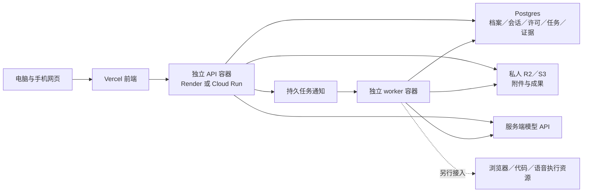

# 求职伙伴的云部署决策与成本模型

日期：2026-10-06。状态：**可审阅方案与本地基础，尚未云部署**。目标是一个面向美国学生、可以逐步增长和融资的产品；首个体验是15分钟比较两个职业方向并选出一个验证行动。模型先用服务端API，不把自训GPU作为起步依赖。下面的推荐是依据当前代码、官方平台能力与公开案例作出的工程判断。

## 建议

**产品目标方案：Vercel承载网页／手机网页，独立容器承载业务API与任务worker；第一候选Render，第二候选Google Cloud Run。Postgres存业务与任务事实，私人R2／S3存文件。**

Render较容易保留现有Fastify、BullMQ与常驻循环；Cloud Run提供更丰富的GCP组合，但需要IAM／私网配置，并决定哪些循环常驻、哪些任务按需。两者都可以作为正式服务，没有“融到资才换成真正云服务器”的必然路线。Vercel也能承载agent／工作流；将其用于前端是我们对现有程序的选择，不是断言它不能做后端。

客户端现在支持显式 `VITE_PLATFORM_API_ORIGIN`，默认仍同源；请求、SSE、私人媒体和原生下载统一连接配置的API。API提供精确credentialed CORS、有限预检、私人缓存策略，原mutation Origin检查和owner校验保留。已通过两个本地同站不同端口的实际浏览器登录、Ollama聊天保存、私人图片加载与视频播放。正式拆到Vercel仍须验收同站HTTPS自有子域（如app／api.example.com）、Secure Cookie、真实入口／代理与私人存储；另一条路是实测同源proxy。不能将localhost验收当成生产HTTPS已完成。



图是建议部署角色，不是已创建的云服务。插件作为用户电脑上的另一个执行端，经真实身份、许可、租约和回执连接；手机审阅不会自动变成插件可信点击。

## 不同方案解决什么问题

| 方案与产品 | 提供什么 | 团队为什么选（判断） | 对我们的主要代价／结论 |
| --- | --- | --- | --- |
| Vercel＋Render | 前端发布／CDN；常驻API和worker；托管PG与队列 | 希望把工程时间投入产品，同时保留常规Node进程 | 首选候选；两套发布入口、认证与媒体衔接需验收 |
| Render同源全栈 | 网页和API同源；同一生态的worker／数据 | 少配置跨域，当前代码改造较少 | 可作第一轮上线；之后独立拆前端，不改变业务模型 |
| Vercel＋Cloud Run／Cloud SQL等GCP产品 | 容器、按需HTTP／jobs、常驻worker pool、IAM与云数据服务 | 已有GCP经验、需要统一私网与资源治理，或有明确按需执行需求 | 强候选；API自身后台timer要移动或用持续CPU，数据库／Redis常驻费用仍存在 |
| AWS ECS／Fargate＋RDS＋S3等 | 可组合容器、私网、角色权限、数据与多区能力 | 团队已有AWS能力，企业／隔离／资源需求明确 | 当前配置更复杂；SQS不是BullMQ直替，现S3静态key也要改造才能用task role |
| DigitalOcean／Hetzner／EC2普通VM | 租一台具有OS、CPU、内存与磁盘的服务器 | 希望控制系统、特殊依赖或运行独立执行器，也愿意维护 | 可正式上线；补丁、TLS、发布、容量、备份与恢复责任更多，单机没有自动HA |
| Cloudflare Workers＋Workflows／Containers＋R2 | 边缘请求、状态／持久流程、容器和文件产品 | 全球轻量API／边缘状态或媒体传输成为重点 | 有力替代；需要适配runtime／生命周期／队列，目前不为此重写全部Fastify＋BullMQ |
| Supabase＋任一网页／计算平台 | 托管Postgres、Auth、Storage等数据能力 | 想减少身份与数据功能的开发时间 | 是数据与身份候选，不是独立长驻worker的完整替代；整合现用户ID与权限后才可使用 |

Vercel／Render／GCP的官方边界与费用见 [托管比较](cloud-managed-options.md)；AWS／VM的来源与迁移责任见 [基础设施比较](cloud-infrastructure-options.md)；Higgsfield、OpenEvidence、Character.AI、Replit披露的组件见 [产品案例](public-platform-stacks.md)。这些方案都使用云计算资源，区别是我们管理OS和网络，还是将更多维护交给托管服务。

## Cloudflare与Supabase的补充核查

Cloudflare Workers付费订阅当前从$5/月起，按请求与CPU收费。HTTP等待／streaming的wall time与CPU time不同：客户端连接期间没有固定HTTP时长上限，但普通isolate内存128MB，付费CPU可配到300秒；响应后 `waitUntil` 最多延长30秒。它并非无限存活的Node进程。[Workers pricing](https://developers.cloudflare.com/workers/platform/pricing/)、[Workers limits](https://developers.cloudflare.com/workers/platform/limits/)

Workflows提供可等待与恢复的多步骤流程；Containers可运行完整runtime／Linux依赖，经Worker与Durable Object代码控制启动和路由。因此不能说Cloudflare只托管静态页面或绝不能运行Python／容器；但现有运行流程要做平台适配并验证关闭、重试与数据边界。[Workflows](https://developers.cloudflare.com/workflows/)、[Containers](https://developers.cloudflare.com/containers/)

Supabase Pro当前从$25/月起，含$10 compute credit，可覆盖一个Micro project，额外项目／资源／用量另计；数据库提供pgvector扩展支持向量检索。Auth与存储可减少开发工作，但不会自动整理蔓藤知识、保证检索质量或替代我们的任务审批。[Supabase pricing](https://supabase.com/pricing)、[Vector columns](https://supabase.com/docs/guides/ai/vector-columns)

其Edge Functions当前256MB内存，wall time免费150秒／付费400秒，CPU每请求2秒（异步I/O另算）；不能把普通长期BullMQ消费者机械搬进去。Pro日备份保留7天；PITR另付费并要求至少Small compute。数据库备份不包含Storage对象，恢复策略仍须覆盖私人文件。[Function limits](https://supabase.com/docs/guides/functions/limits)、[Backups](https://supabase.com/docs/guides/platform/backups)

## 预算由实际使用决定，也有固定底座

**月账单＝固定资源＋模型／语音／执行用量＋文件与流量＋监控等配套。**

- 固定资源：持续可用的数据库、队列、常驻worker、平台／团队费；没有用户时也可能计费。
- 变量：实际模型调用及累计上下文token、音频分钟／字符、浏览器／沙箱时长、存储GB、读取操作与网络传输。
- 工程与运营：上线／值守、故障恢复、数据库迁移、用户支持；租VM账单低不等于维护总成本低。

用户量是成本模型的一个输入，不能用注册用户直接推算服务器价格。应记录MAU、每位活跃用户的会话次数、每次任务的模型调用数、平均输入／输出token、语音比例、文件保存期和峰值并发。Agent一次可见回复可能调用模型多次；重放长历史、RAG与工具结果也增加输入量。

设MAU为 `U`、每人每月会话为 `S`、每会话模型调用为 `C`、每次平均输入／输出token为 `Ti/To`，模型每百万token单价为 `Pi/Po`：

```text
模型调用数 = U × S × C
模型月成本 = U × S × C × (Ti × Pi + To × Po) / 1,000,000
```

缓存、不同模型路由、评估调用和重试分别计价；真实价格应在选定provider／model时核对。下面只演示算术，**不是任何真实模型的报价或用户预测**：假设每人8次会话、每次10次调用，每调用输入2,000／输出600 token，虚构单价输入$1／输出$5每百万token。

| 活跃用户 | 月调用数 | 输入／输出token | 示例模型费用 |
| --- | --- | --- | --- |
| 100 | 8,000 | 16M／4.8M | $40 |
| 1,000 | 80,000 | 160M／48M | $400 |
| 10,000 | 800,000 | 1.6B／480M | $4,000 |

这说明早期能否保持每位活跃用户的单位成本，可能比网页服务器选哪个更影响后续商业空间。面试实时语音、浏览器执行和更长上下文要另加；不能把上表套到所有功能。

当前已核价的一个可审阅非HA资源例：Render API512MB $7＋普通worker512MB $7＋PG1GB RAM $19＋数据库10GB $3＋队列$10＝**$46/月**；加一个Vercel Pro deploying seat $20＝**$66/月**。更宽松API／worker各2GB、Render Pro workspace等的例子是**$127/月**（含上述Vercel席位）。均未含模型、私人bucket、额外流量、域名、税或独立执行池；512MB也不是已验Chromium／语音推理规格。[Render pricing](https://render.com/pricing)、[Vercel Pro](https://vercel.com/docs/plans/pro-plan)

这些是资源配置例而非按用户数保证的价目。上线前测资源；上线后按实际账单与用量调优，不把开户赠金当长期单价。首批体验确认前不需要购买大量机器。

## 让后续调整更容易

保留独立求职领域、profile／job／evidence等版本化contract，模型通过薄adapter接入。网页只与自己的API交互，不把蔓藤业务流程写进某云专属配置。用标准Postgres保存业务事实，任务输入／许可／回执持久化；Redis只传执行通知，未知外部结果不盲目重做。

API与worker可分别增加副本，普通任务与浏览器／代码／语音执行池分开。容器迁到另一计算平台通常比重写业务更直接，但角色权限、队列语义、网络、文件接口和数据迁移仍要实测；API自动扩容不会自动增加数据库连接额度。保留导出、迁移／备份恢复与回滚演练，才能知道调整成本。

扩容依据应是同时进行的聊天流、任务队列等待、worker资源、数据库连接／慢查询、私人媒体带宽和每任务成本；不预定“达到一万注册用户就必须Kubernetes”。企业合规／私网、专用执行硬件、实际成本或平台限制出现后，再评估更大的AWS／GCP架构。

## 当前可审阅基础与未完成部分

已有独立Node容器、web／worker／migrate三个角色、严格生产配置、同源静态入口、PG outbox与安全队列恢复，见 [生产配置](../../infra/platform/production/README.md) 和 [本地验证](verification.md)。这轮没有部署、购买云服务或打开付费模型。

正式上线仍需：选定Vercel分离或同源入口并验收真实HTTPS身份与会话、账号恢复；实际私人bucket；迁移与同版本发布顺序；流式与弱网恢复；托管队列／数据备份演练；不含私人正文的业务监控；目标Linux执行端验收。云选型完成后，产品工作继续围绕“两方向比较＋一个验证行动”推进。

## 附录：小内存开发与托管模型（2026-10-06核对）

日常开发建议保留网页与业务API，把模型推理交给托管API；Mac不必同时常驻Ollama、Kokoro和Whisper。当前已有OpenAI文字／Agent／图片／TTS／转录／Realtime、OpenRouter文字／Agent、Ark文字／Agent／Seedance视频、fal图片／视频的adapter。接入能力不等于账户权限和实际调用已经验证；密钥仍只在后端，付费调用仍须显式开启。本次未启用付费调用或部署。

下面是官方当日Standard、短上下文（不超过272K输入token）的文字价格与算术示例，未计缓存、区域附加或工具费；模型效果仍需按我们的任务评估。[OpenAI官方价格](https://developers.openai.com/api/docs/pricing)、[Luna支持Responses与function calling](https://developers.openai.com/api/docs/models/gpt-6-luna)

| 模型与用途候选 | 输入／输出每百万token | 每次10,000输入＋2,000输出 | 相同用量的1,000次调用 |
| --- | --- | --- | --- |
| gpt-6-luna：低成本开发与日常对话 | $0.10／$0.50 | $0.002 | $2 |
| gpt-6.1-sol：较复杂的规划与评审 | $2／$10 | $0.04 | $40 |

这相当于每轮只有一次模型调用的1,000轮，**不是1,000个用户的费用**。Agent一轮可能请求模型多次，历史上下文、工具结果和reasoning输出也计入实际token；语音、图片、视频、浏览器／CLI执行、服务器、数据库、存储与流量均另计。当前文字默认gpt-6-astra的同档价格为输入$10／输出$50每百万token，开发时应明确选择所需模型，避免把最贵默认用于所有交互。

低成本文字模型需要服务端设置 `OPENAI_CHAT_MODEL`，网页也应确认所选模型；没有自动按价格路由。Realtime Mini 同样是候选，需要设置 `OPENAI_REALTIME_MODEL=gpt-realtime-2.1-mini`；当前默认 `gpt-realtime-2.1` 不适用下面的 Mini 费率。配置模型不会自动打开付费调用。

语音可使用现有OpenAI通道卸下本机推理：gpt-4o-mini-transcribe官方估计$0.003／分钟（实际按token计费）；gpt-transcribe为$0.0045／分钟。gpt-4o-mini-tts按文本输入$0.60、音频输出$12每百万token计费。gpt-realtime-2.1-mini的音频输入／输出为$10／$20每百万token，文本另为$0.60／$2.40每百万token，不能当成固定每分钟总价；额外输入转录单独计费。[语音价格与计费单位](https://developers.openai.com/api/docs/pricing)、[Realtime Mini的WebRTC能力](https://developers.openai.com/api/docs/models/gpt-realtime-2.1-mini)

图片视频按具体endpoint与规格计费，例如fal FLUX Schnell为$0.003／megapixel并向上取整；Kling 2.5 Turbo Pro图生视频5秒$0.35、额外每秒$0.07。Ark Seedance按视频token及分辨率、输入视频等条件定价。OpenRouter Standard额外对购买credits收5.5%，推理仍按供应商费率。[FLUX计费](https://fal.ai/models/fal-ai/flux/schnell)、[Kling计费](https://fal.ai/models/fal-ai/kling-video/v2.5-turbo/pro/image-to-video)、[Ark价格](https://docs.volcengine.com/docs/ark/model-pricing?lang=zh)、[OpenRouter计费](https://openrouter.ai/business)

**托管模型API账单与云服务器账单分别计算。** 前者承担模型推理；后者承担业务API、队列worker、数据与执行环境。用户已确认SSH服务器为edaix-dev；2026-10-06 09:00 UTC通过既有SSH配置、BatchMode与严格host-key校验完成只读核查：实际使用非root账户，Ubuntu 26.04 LTS／x86_64；Intel Core Ultra 7 270K Plus，24核／24线程，当前账户可调度24个逻辑CPU；RAM总计约29.96 GiB、当时MemAvailable约24.05 GiB；swap约8 GiB、当时剩余约6.78 GiB；根卷与账号home的容量查询均约1.83 TiB、当时账户可用约261 GiB。Docker client／server 29.7.2与只读daemon info可访问，containerd 2.3.3已安装。可用内存、swap和磁盘余量都是共享主机的瞬时观测，不能当作保留配额或长期容量承诺。

PCI识别到Intel集显与NVIDIA GeForce RTX 3090，但nvidia-smi查询以exit 18失败：`Failed to initialize NVML: Driver/library version mismatch`，用户态NVML库595.91与已加载内核模块595.84不一致。因此本次未能核实显存或GPU推理可用性；应先由服务器管理员修复驱动／库匹配并验收，再评估任何GPU推理任务。本次仅只读核查，未安装、sudo、修改远端配置、迁移项目、重启或修复驱动。

对16 GiB Mac，建议下一步把开发API、队列worker、Docker依赖及需要时的构建／浏览器／CLI执行放到edaix-dev，Mac主要保留编辑器、浏览器预览和真实Chrome插件交互。远端服务继续只监听localhost，通过SSH端口转发预览；真实身份、授权、租约和结果持久化边界保留，迁移前再按实际并发检查资源。**CPU业务后端／worker与GPU模型推理分别规划。** 即使修复3090，也不应直接把共享开发机当成生产推理服务；先用模型API卸下Ollama、Kokoro和Whisper的本机常驻负担，实际用量、延迟或数据要求出现后再评估专用推理。生产仍沿用正文的托管部署方案，默认不立即自建GPU服务。

后续执行记录（2026-10-06）：用户已授权并完成独立远端开发迁移。API、worker、web、Postgres/Redis与 CPU Ollama/Kokoro/Whisper 在远端 loopback 运行，Mac通过SSH预览；23张表、27份附件迁移hash一致，虚构网页聊天和语音保存已验证。本项目本地服务已停、源数据保留，商业模型仍关闭、GPU未使用。上面的只读观测与建议属于迁移前阶段；当前运行、重启和回退边界见 [远端开发说明](remote-development.md)。正式云产品部署方案未因此改变。
