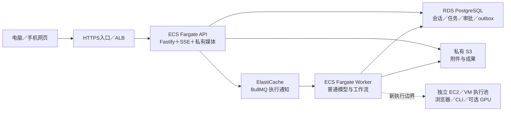

# AWS 与普通云主机：我们的部署选择

状态：**调研建议，未购买、未部署**。官方来源核对日期：**2026-10-06**。本文比较 AWS ECS／Fargate、DigitalOcean Droplets 与 Hetzner Cloud／独立服务器；不代表这些环境已经通过我们产品的运行验收。Vercel／Render 起步路线见 [部署方案](deployment-plan.md)。

**对当前团队，先采用托管前端、API、worker、数据库和私有对象存储更合适；需要 Docker、GPU 或特殊浏览器隔离时，再增加独立执行主机。**这是基于现有代码和维护范围的判断。AWS 能组成成熟的大规模系统，普通 VM 也能运行正式产品；差异主要在谁负责故障恢复、私网隔离、容量与发布，而不是哪家公司能显示一个 chat 页面。

## 三条路线实际购买了什么

| 路线 | 云厂商主要负责 | 我们仍须负责 | 对当前产品的影响 |
| --- | --- | --- | --- |
| AWS ECS／Fargate＋RDS＋S3＋ElastiCache | 容器调度基础设施；数据库／缓存的选定托管功能；对象存储 | VPC／IAM／安全组、服务拆分、容量和连接预算、备份选择／恢复演练、应用状态与任务幂等、发布管线 | Fastify／BullMQ 可以保留；首次配置比应用托管多，特殊执行器须另设计 |
| DigitalOcean VM＋可选 Managed PostgreSQL／对象存储 | VM 和网络；另外购买的托管数据库功能 | VM 的 OS／Docker／反向代理／TLS／监控／升级；自建数据库和队列的完整维护；多机发布与恢复 | Docker executor 更容易获得真正 daemon；可以将 PG 保持托管，避免所有组件挤在一台机器 |
| Hetzner Cloud VM 或独立服务器＋外部私有对象存储 | 所选计算、网络、磁盘和另行开启的备份／LB | OS、数据库、Valkey、升级、备份一致性、故障切换、发布／回滚、执行池隔离 | 自部署控制较多；不能把磁盘快照、一个 LB 或一台独服当作应用 HA |

DigitalOcean 明确将 Droplet 定义为 IaaS：OS、应用和数据由客户管理；其托管 PostgreSQL 则提供不同的维护边界。[Droplet 职责与价格](https://www.digitalocean.com/pricing/droplets)、[PostgreSQL 托管功能](https://docs.digitalocean.com/products/databases/postgresql/details/features/) AWS 同样采用共享责任，托管服务并不替客户配置业务授权和应用恢复。[AWS Shared Responsibility](https://aws.amazon.com/compliance/shared-responsibility-model/)

## AWS：保留应用，把基础设施分清

以下是可评估的目标架构，不是当前已部署状态。前端仍可在 Vercel；迁移后端到 AWS 不要求同时迁移前端。

API 与普通 worker 是两种 ECS Service；RDS／ElastiCache 放在受控私网，入口只开放需要的 HTTPS 流量。服务应跨 AZ 安排副本和健康检查。只有购买 RDS Multi-AZ，不会让单副本 API、单 worker 或未冗余的执行主机自动成为 HA。

### Postgres：备份与 HA 是两项配置

RDS DB instance 的自动备份保留期可设 0–35 天，0 会关闭自动备份；Multi-AZ DB cluster 则为 1–35 天。PITR 能恢复到保留窗口内的时点，但需要实际恢复与核验。[保留期](https://docs.aws.amazon.com/AmazonRDS/latest/UserGuide/USER_WorkingWithAutomatedBackups.BackupRetention.html)、[RDS 自动备份](https://docs.aws.amazon.com/AmazonRDS/latest/UserGuide/USER_WorkingWithAutomatedBackups.html)

RDS Multi-AZ **DB instance** 在另一 AZ 同步维护 standby，并用于故障切换；该 standby 不提供读扩展。Multi-AZ DB cluster 和 read replica 是不同产品结构，选择和价格不能混为一谈。[RDS Multi-AZ DB instance](https://docs.aws.amazon.com/AmazonRDS/latest/UserGuide/Concepts.MultiAZSingleStandby.html)

我们的 SQL／migrations 可以保留，但要验证 TLS、连接池预算、迁移权限和滚动兼容。数据库恢复到过去时点时，S3 文件不会同时回到那个时点；需要共同设计保留期和删文件策略。这是现有“DB metadata＋private blob”结构带来的应用责任。

### 队列：ElastiCache 最接近现有 BullMQ，SQS 是另一种实现

最小迁移可评估 **node-based、cluster-mode disabled 的 ElastiCache Valkey／Redis-compatible 实例**，保留 BullMQ。官方 parameter group 支持 `maxmemory-policy=noeviction`；默认 eviction 策略不能当成队列配置。内存满时应明确失败和告警，不能删除队列 key。[ElastiCache 参数](https://docs.aws.amazon.com/AmazonElastiCache/latest/dg/ParameterGroups.Engine.html)、[BullMQ 生产建议](https://docs.bullmq.io/guide/going-to-production)

当前 `queue-connection.ts` 构造单个 Redis endpoint，并非 Redis Cluster 客户端；不能只把 URL 换成任意 cluster/serverless endpoint 就假设所有 BullMQ Lua、阻塞连接与多 key 行为兼容。生产应实测 TLS、凭据、命令、断线、重连与受控 outbox reconciliation。

ElastiCache Multi-AZ 需要 replica，并能将 primary 故障转交 replica；未配置 replica 的单节点不提供同等恢复。新 durability 选项和常规异步复制不是相同保证，不能将默认缓存实例称为零丢失队列。[ElastiCache Multi-AZ](https://docs.aws.amazon.com/AmazonElastiCache/latest/dg/AutoFailover.html)、[Durability 选项](https://docs.aws.amazon.com/AmazonElastiCache/latest/dg/Durability.Options.html) PostgreSQL 继续保存冻结定义、许可、尝试与结果状态，缓存故障不能授予重复执行权限。

SQS 可以减少自管 Redis 的工作，但**不是替换 Redis URL**。需要新的 outbox producer、consumer、visibility heartbeat、ack／DLQ 和取消／租约处理；保留 DB generation／审批／checkpoint。Standard Queue 至少一次投递，重复处理须由应用控制。Visibility 最长为首次 receive 后 12 小时，延长不会重置该总上限。[SQS 至少一次语义](https://docs.aws.amazon.com/AWSSimpleQueueService/latest/SQSDeveloperGuide/standard-queues-at-least-once-delivery.html)、[Visibility timeout](https://docs.aws.amazon.com/AWSSimpleQueueService/latest/SQSDeveloperGuide/sqs-visibility-timeout.html) 外部动作结果未知时，自动 redelivery 仍不能变成再次调用模型或提交申请。

### S3 与 IAM：私有成果不走公开 bucket

启用 account／bucket 的 Block Public Access，并配置最小权限；用户仍经我们的 API owner 校验读取文件。S3 的 Range／If-Match 接口与现有私有文件服务相符，实际 bucket 的权限、版本变化、取消、206／416 和双账号隔离仍须验收。[S3 Block Public Access](https://docs.aws.amazon.com/AmazonS3/latest/userguide/access-control-block-public-access.html)、[GetObject](https://docs.aws.amazon.com/AmazonS3/latest/API/API_GetObject.html)

AWS 推荐通过 ECS **task role** 向应用提供临时权限，execution role 负责镜像／启动阶段的权限，两者职责不同。[ECS task IAM role](https://docs.aws.amazon.com/AmazonECS/latest/developerguide/task-iam-roles.html) 当前 `S3BlobStorage` 明确传入 access key／secret，生产 config 也要求这两个字段；仅给 ECS 添加 task role 还不能让本产品自动使用它。要采用 task-role 凭据，必须新增明确的 credential mode、SDK provider-chain 接入和拒绝错误配置的测试；本轮没有实现此迁移。

### 流式响应、发布和回滚

ALB 连接 idle timeout 默认 60 秒，可调 1–4000 秒；它是连接闲置限制，不是后台任务持久化方案。现 API 的 15 秒 SSE keepalive 应经过真实入口验证 flush、取消、cookie 和部署 drain；图片／视频任务仍由独立 worker 执行。[ALB attributes](https://docs.aws.amazon.com/elasticloadbalancing/latest/application/edit-load-balancer-attributes.html)

ECS rolling deployment 可启用 circuit breaker／rollback，依据容器与 LB 等健康检查回退到已完成的 deployment；没有已完成版本时，不能假设有可用回滚点。[ECS deployment circuit breaker](https://docs.aws.amazon.com/AmazonECS/latest/developerguide/deployment-circuit-breaker.html) 我们仍须构建和固定镜像 digest，使用发布身份，单独执行兼容 migrations，并验证 SIGTERM／队列 drain。容器回滚不会撤销数据库写入、已收费调用或外部动作，业务状态须保留。

## 浏览器、Docker 与 GPU：执行器按需要单独部署

| 工作负载 | Fargate | 普通 VM／ECS EC2 | 本产品的实际距离 |
| --- | --- | --- | --- |
| Fastify／BullMQ 普通任务 | 可以评估标准容器部署 | 同样可以运行 | 新 ingress／生产镜像仍需目标云验收；不因迁云改变任务许可 |
| Playwright／Chromium | 可研究专用镜像，但不能保证现 sandbox／共享内存参数直接兼容 | 可控制 OS／seccomp／浏览器依赖 | 当前 production 镜像未带 Chromium；Linux 目标环境、网络策略和子进程回收须实际测试 |
| 当前 Docker CLI executor | 不支持现有 host daemon／privileged 方案直接搬入 | 可有真正 daemon，需独立可信执行主机 | daemon host bind path、硬磁盘配额、镜像白名单、网络隔离与真实授权链未作为云环境验收 |
| 自托管模型 GPU | Fargate 不支持 task GPU 配置 | ECS EC2 GPU 或选定 GPU VM／独服可评估 | 不需要为了调用远端图像／视频 API 先租 GPU；现 CPU 语音服务的 Linux 推理仍未验证 |

Fargate task 明确不支持 `gpu`、`privileged`、`ipcMode`、`dockerSecurityOptions` 等配置，也限制部分 Linux capabilities／shared-memory 参数。[Fargate task differences](https://docs.aws.amazon.com/AmazonECS/latest/developerguide/fargate-tasks-services.html) ECS 的 GPU 路线是有 GPU 的 EC2 container instances、驱动与相应 runtime，而不是 Fargate 开一个开关。[ECS GPU workloads](https://docs.aws.amazon.com/AmazonECS/latest/developerguide/ecs-gpu.html)

Playwright 官方 Docker 文档针对抓取不可信站点建议专用用户与 seccomp；其测试镜像本身不是现成的生产网页隔离服务。我们需要保留 public-page 网络约束，验证 Chromium sandbox、资源限制和取消回收，不能通过自动关闭 sandbox 宣称兼容。[Playwright Docker](https://playwright.dev/docs/docker)

Docker 官方强调只有可信主体能控制 daemon；daemon 可以挂载并修改主机文件。独立执行主机能减少与 API／数据库共机的影响，但仍须实现限定命令、镜像、挂载路径、资源和网络权限；不能把 docker socket 直接交给网页或用户代码。[Docker daemon security](https://docs.docker.com/engine/security/)

DigitalOcean 有独立 GPU Droplet 产品，GPU 类型与 region 组合须按当前 availability 表核对，不能从普通 CPU VM 推断。GPU Droplet 不能直接 resize，multi-node 需另核支持与配额。[GPU region availability](https://docs.digitalocean.com/products/droplets/details/gpu-availability/)、[Droplet limits](https://docs.digitalocean.com/products/droplets/details/limits/)、[Team limits](https://docs.digitalocean.com/platform/resource-limits/)

Hetzner 当前 GEX45／GEX131 是 **独立 GPU server** 系列，普通 Cloud VM 并非这些机器。官方列出的 GPU、RAM、存储是固定配置，增加硬件需选另一型号；不能把旧 GEX44 的历史新闻价格当今天报价。[当前 GPU 配置](https://docs.hetzner.com/robot/dedicated-server/server-lines/gpu-server/)、[GPU 产品页](https://www.hetzner.com/dedicated-rootserver/matrix-gpu/)

## 普通 VM：可以正式上线，但要准备实际维护体系

单机方案可以运行反向代理＋API＋worker，并连接托管 PG 和私有对象存储。Valkey 若自建，须限定私网／认证、`noeviction`、持久化、磁盘容量和恢复；API／worker 的退出和重启由受控 service manager 处理。这是一个可实施方案，不是本轮已制作或部署的配置。

自部署意味着我们承担 OS／Docker／内核补丁、SSH 身份、TLS 续期、镜像更新、磁盘与日志上限、监控、备份和恢复。当浏览器、Python 推理和代码任务争抢 CPU／内存时，新增 VM 和调度策略也由我们负责。DigitalOcean 现有 autoscale pool 文档明确列出尚不支持 health check；不能将 VM 自动扩缩理解为已经具备应用发布健康门禁。[Droplet autoscale limits](https://docs.digitalocean.com/products/droplets/details/limits/)

VM 发布可采用固定镜像 digest、staging smoke test、单次 migration、滚动或蓝绿切换和保留前一镜像。但这些要由自己的 CI／部署脚本及 LB／proxy 配合；一次 `docker compose up` 不保证无停机、自动 rollback 或数据库兼容。单台 VM 的重建、宿主故障和升级可能影响全部共机服务；提高可用性至少需独立数据层、冗余 API／worker、健康路由和恢复演练。

DigitalOcean Managed PostgreSQL 官方声明每日完整备份＋WAL、过去 7 天 PITR，带 standby 的配置自动 failover。最小单节点不因此变成 HA。[Managed PostgreSQL features](https://docs.digitalocean.com/products/databases/postgresql/details/features/) 截至核对日，standby 一般需至少 2 GB RAM；官方还已公告 **2026-10-15 新账号、2026-11-30 全账号的新 Standard 集群不能添加 standby／read-only nodes**。若以其作为上线 HA 数据库，应重新核对 Advanced Edition 配置和价格。[Standby 条件](https://docs.digitalocean.com/products/databases/postgresql/how-to/add-standby-nodes/)、[已公告的 plan limits](https://docs.digitalocean.com/products/databases/postgresql/details/limits/)

Hetzner 自动 Backup 为每日磁盘副本、7 个槽位，未包含 attached Volumes；正在运行的机器快照不能保证数据一致性。它也会随原 server 删除，保留策略须另外安排。数据库需自己的 WAL／逻辑备份或其他受测恢复机制，不能用整机快照冒充 PITR。[Backup overview](https://docs.hetzner.com/cloud/servers/backups-snapshots/overview/)、[一致性和删除边界](https://docs.hetzner.com/cloud/servers/backups-snapshots/faq/)

## 价格：先核同一个系统，再比较账单

以下只记录核对日官方价目或明确公式，**不是本产品预算、所需规格或用户容量保证**。均不包含商业模型费用；网络、备份、额外节点、税费和监控另计。

| 项目 | 官方可核对的单位信息 | 正确解释 |
| --- | --- | --- |
| AWS Fargate Linux x86／US East N. Virginia | 官方示例 CPU `$0.000011244/vCPU-second`，内存 `$0.000001235/GB-second`；默认含 20 GB ephemeral storage | 假设 1 vCPU＋2 GB 连续 730 小时，按公式仅 compute 约 `$36.04`；两份这种 task 约 `$72.08`。这是我们的算术示例，不含 ALB／PG／Redis／NAT／S3／流量／log，且不代表我们的测定规格。[Fargate pricing](https://aws.amazon.com/fargate/pricing/) |
| AWS 完整系统 | RDS、ElastiCache、ALB／网络、S3 和可选 SQS 分别计费，区域和所选冗余会改变账单 | 在同一 region／实际 uptime／副本数／出站流量下使用 calculator；不能用一个 Fargate task 的价格当全站总价。[RDS](https://aws.amazon.com/rds/postgresql/pricing/)、[ElastiCache](https://aws.amazon.com/elasticache/pricing/)、[VPC／NAT](https://aws.amazon.com/vpc/pricing/)、[SQS](https://aws.amazon.com/sqs/pricing/)、[AWS Calculator](https://calculator.aws/) |
| DigitalOcean Basic bundled CPU VM | 当前表 512 MiB／1 vCPU `$4/mo`，4 GiB／2 vCPU `$24/mo`；后者是 shared CPU | 最小价只说明一个 VM 资源单位，不包含 HA 和完整产品。当前 v5 是另一个按资源小时计费的系列，**没有 bundled 的月 cap**，不能混算。[CPU price table](https://www.digitalocean.com/pricing/droplets)、[billing differences](https://docs.digitalocean.com/products/droplets/details/pricing/) |
| DigitalOcean Managed PostgreSQL | 当前 Standard Basic 表 1 GiB／1 vCPU `$15.15/mo`，storage 另按所选范围计费 | 是单节点基础行，不是 HA 价；上述 Standard plan 公告需计入正式选型。[Managed DB pricing](https://www.digitalocean.com/pricing/managed-databases) |
| DigitalOcean VM 备份 | 百分比计划每周为 VM价的20%、每日30%；另有使用量计划 | backup 与 snapshot 是额外费用，保留期、Volume 和一致性须分别核。[Droplet backup pricing](https://www.digitalocean.com/pricing/droplets) |
| Hetzner Cloud | 官方按小时计费并有对应月上限；Backup 为 server价20%，Snapshot按压缩占用GB/月；Primary IP单独计费 | 本轮官方 SKU 金额表依赖动态选择，未可靠取得当前型号价，因此不引用旧年／论坛的便宜数字。最终按 region、货币、VAT、IP／backup及所选型号官方 quote 核定。[Billing FAQ](https://docs.hetzner.com/cloud/billing/faq/)、[官方 Cloud 价格页](https://www.hetzner.com/cloud/) |

本项目图片／视频生成的大部分资源需求来自远端模型 API。调用量、私人文件容量与播放出站流量，可能比静态网页流量更影响总价；应记录实际 usage／任务时长／文件量后再选规格。这是针对当前实现的推断，尚无生产负载数据支持固定用户数或月成本承诺。

## 迁移代价：哪些可以复用，哪些必须改

| 当前部分 | 迁到 AWS Fargate／托管数据 | 迁到普通 VM |
| --- | --- | --- |
| React／Fastify API | 可以保留；配置 ingress、TLS／origin／cookie、ALB health／SSE／Range，分离前端条件与 Vercel 路线相同 | 可以保留同源；自己的 proxy／TLS／static／process 管理须验收 |
| Postgres schema／outbox | 可以保留，迁移与连接权限／池预算／PITR演练 | 连接托管 PG 改动较小；自建 PG 增加备份、WAL、升级和 failover 工作 |
| BullMQ | ElastiCache 非分片 endpoint 是较小适配，仍需目标兼容／fault tests；换 SQS 需要新的 queue adapter 与 consumer | Valkey 可维持接口，持续维护／持久化／容量与 failover由我们承担 |
| 私有 blobs／Range | S3 接口可复用；task-role auth 需要显式改 config／storage；ACL／IAM与owner边界分别验证 | 可继续用私有 R2／S3；不能默认 API、worker与远程执行机共享本地文件 |
| 工作流审批／lease／checkpoint | 完整保留；跨副本通知和服务重启不改变许可 | 完整保留；process重启／任务恢复仍须同一安全校验 |
| Browser／CLI runner | 新镜像与独立 executor routing／网络／资源边界；现 CLI不能直接Fargate | 可获得daemon，但须daemon host路径一致／硬配额／隔离／cleanup实际proof；不应与生产PG共机 |
| CPU TTS／ASR | literal-loopback 服务只适合同一受控host/network namespace；目标Linux推理未验收；远程拆分需新服务授权 | 可在专用Linuxhost做离线资产／真实音频／取消验证；不是复制macOS资产路径即可生产 |
| CI／监控／rollback | 新 IaC／IAM／ECR／发布门禁／告警；ECS回滚不回退业务写入 | 自己制作并维护发布脚本／镜像、proxy切换、备份、监控和恢复runbook |

从现有 Render 同源容器转到 ECS，主要是基础设施和认证／执行边界接入，普通业务代码不必推倒重写。换 SQS、远程 browser／CLI、task-role 凭据和分离前端，则是明确的新开发范围；不能按“换一个环境变量”估计。

## 为什么先托管，何时值得用大云或 VM

**当前建议属于推断：**我们仍在验证产品用途，尚无生产流量、队列等待、资源占用与稳定性数据。托管基础设施让团队较少处理 OS、磁盘、数据库 patch 和一次发布的细节，把时间留给真实对话、结果、求职计划与用户反馈；它不替代备份恢复、权限或故障测试。

当出现实际的私网／企业 IAM／固定 region要求、多种执行池、GPU资源、独立团队治理、严格恢复目标或托管平台经测量的限制时，AWS 的专用服务更有价值。应先测量并设计 VPC／数据层／runner，再逐部分迁移；不需要为了“以后可能有很多用户”现在引入 Kubernetes 或改掉 PostgreSQL／BullMQ。

如果已经有能维护 Linux／数据库／备份的人，预算限制明确，或必须控制 Docker／GPU／内核隔离，VM 是合理路线。可先“托管网页＋托管 PG／blob＋专用 VM executor”的混合方式，保留较小故障影响范围；若全部单机自建，应接受和实测该系统的停机／恢复边界。

## 大型 AI 产品的公开案例只能证明公开部分

AWS 官方 Perplexity 案例披露其使用 EC2 支撑产品组件，并使用 SageMaker HyperPod 与 EC2 GPU做训练和推理。它能证明该公司的部分 AI基础设施使用 AWS，不能证明其 **2026 年整站** 的 CDN、数据库、队列、浏览器、移动端或全部供应商；更不能直接推出本项目也应复制同一规模的训练集群。[AWS Perplexity case study](https://aws.amazon.com/solutions/case-studies/perplexity-case-study/)

本文没有连接云账户、读取生产凭据、运行外部执行任务或购买服务。所有链接为官方产品／文档，价格只记录明确可核对项；当前实现边界以仓库源码与本地验证记录为准。下一步仍是完整 HTTPS／身份／SSE／任务恢复／private media／备份和目标执行器验收，不能将技术成熟等同于产品已经生产就绪。
