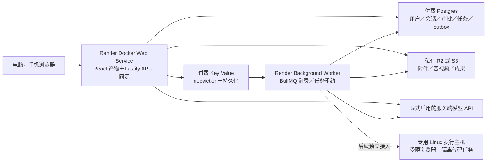

# 网页 Chat／Agent 部署路线

状态：**建议，未部署**。官方资料核对日期：**2026-10-06**。已有可审阅的生产入口代码与本地 HTTP／容器验证；本次补充数据／执行就绪探针、worker心跳与连接池预算配置，独立真实PG／Redis／HTTP与worker生命周期11组通过，API427通过／4跳过、网页399通过；正式运维验收仍待执行。没有购买服务、配置真实云端密钥、公开端口或云部署。本人主开发预览仍是导出版本 `da4434a`、迁移账本001–016，当前017–021源码未进入主实例。

## 推荐起步方案

**Vercel 托管网页和手机网页，Render 托管 Fastify API 与 Background Worker** 是合理的上线目标；Postgres、Key Value 和私有 R2／S3 继续作为独立服务。Vercel 负责静态前端的发布和 CDN，持续运行的 Agent、任务队列与执行器留在后端。现有技术可以继续使用，不需要先重写成 serverless 或 Kubernetes。CLI 代码执行先关闭，之后放到专用执行主机；Python 语音服务已有 Linux 开发实例验证，完成目标生产镜像与容量验收前不宣称生产可用。

**生产容器保留 Render Docker Web Service 同源服务 React 静态产物与 API 的参考入口；客户端也已支持显式独立API origin。**默认 `/api/platform` 同源，分离配置经薄client统一请求、SSE与私人媒体。API使用精确credentialed CORS并保留mutation Origin与owner校验。生产容器已完成本地Linux ARM64启动验收，分离入口已完成本地两个同站不同端口浏览器验证；均不表示真实云HTTPS与Secure Cookie已通过。

这是部署角色图，不是已经存在的云架构。当前平台 API 还负责 outbox dispatch，Worker 消费 BullMQ；数据库保存业务状态和许可，队列传递执行通知，对象存储保存私人文件。

Render 支持 Docker Web Service 与连续运行的 Background Worker，后者是独立服务，不接收 HTTP 入站。[Docker on Render](https://render.com/docs/docker)、[Background Workers](https://render.com/docs/background-workers) API 和任务 worker 使用付费实例；Free Web Service 会闲置休眠，Background Worker 没有 Free 实例，不适合作为正式任务消费者。[Render Free 限制](https://render.com/docs/free)

## 组件怎么部署

| 组件 | 建议 | 与当前源码的关系 |
| --- | --- | --- |
| 前端＋API | Vercel 前端＋Render API的分离配置与同源Docker参考入口均已实现本地基础 | React19／Vite＋Fastify。默认同源；显式 `VITE_PLATFORM_API_ORIGIN`、精确CORS及私人URL统一解析。可选 `PLATFORM_WEB_STATIC_DIR` 保留SPA／API边界。云HTTPS与Secure Cookie仍需验收 |
| 任务 worker | 同一版本的独立 Docker Background Worker | `pnpm --filter @companion/platform-api worker` → `src/worker-main.ts`；不要在 HTTP 请求完成后临时启动一个异步任务就当持久队列 |
| 数据库 | 付费 Render Postgres，与 API／Worker 同 workspace、同 region | 继续 `pg`／SQL migrations／outbox；内部连接 URL，明确连接池预算，禁用不必要的公网访问 |
| 队列 | 付费 Render Key Value，显式 `noeviction` 与持久化 | BullMQ／Redis-compatible 长连接；不同环境独立队列与数据，不混用生产、预览和本地任务 |
| 文件 | 私有 R2，或选择 AWS S3 | 已有 `S3BlobStorage` 与 API 私有 Range；不能继续依赖 `.local/platform/blobs` 保存生产附件 |
| 模型 | 服务端配置当前已实现的 provider，明确开关／可用性／配额 | 前端不持有 key；没有配置的能力如实禁用，不用固定回复假装上线了模型 |
| Python TTS／ASR | 已有本人Linux CPU开发实例验收，再验证目标生产镜像与资源 | 目前只允许 literal loopback HTTP；不是将 URL 改成 Render private hostname 就能接入 |
| 浏览器 | 完成目标 Linux／容器运行和隔离验证后，再启用 bounded public-page executor | Playwright Chromium 与 OS 依赖须预装；现边界不登录、不解验证码、不最终提交 |
| CLI／Codex | 独立、可审计的 executor host；普通 Web／Worker 默认关闭 | 当前 adapter 调用 Docker daemon、使用 daemon host 上的 bind mounts；普通托管容器不等于有可用嵌套 Docker |

API、Worker、数据库和队列尽量在同一区域，优先按首批美国用户的实际延迟选择，而不是现在猜一个地域。Render 私有网络要求同 workspace／同 region；Static Site 不在这张私网中。[Render Private Network](https://render.com/docs/private-network)

## 流式聊天与长任务

Render 官方技术说明支持 Web Service 流式响应，HTTP 响应上限为 100 分钟。这是托管层能力，不应变成我们的单个聊天／Agent默认时长。[Render AI 架构说明](https://render.com/articles/scaling-ai-applications-prototype-to-millions)

当前 `app.ts` 的消息接口以 SSE 输出，15 秒 keepalive，并将内容／lease 写回数据库；`apps/web/src/api.ts` 会把没有 terminal event 的提前断连显示为未确认。因此生产验收须经过真实 HTTPS 入口验证首个 token、持续 flush、取消、断网和保存后恢复；不能只在 localhost curl 成功就宣布流式上线。API、CDN／proxy和模型请求各层都有自己的 deadline，新增代理必须明确关闭响应缓冲且保留取消信号。

当前已登录HTTP限流按真实userId和用途，在PostgreSQL共享原子计数：普通API默认120次／分钟，直接聊天、朗读、转写入口各20次／分钟，实时会话创建4次／小时，取消与释放等控制操作另用120次／分钟。这是入口请求额度，任务并发另有上限；它不是token或美元预算。跨实例、同IP不同账号、并发临界值、旧身份与数据库故障已有真实HTTP／PG检查。匿名认证和公开接口仍用规范化socket地址hash；源码不信任客户端转发头，代理后它可能代表共同入口。因此生产仍需明确边缘匿名防滥用、精确入口信任和各用途配额，并测共享计数写入／清理负载。前端退避不能代替这些验收。见 [共享请求限额](verification.md#按真实账号共享请求限额)。

图片／视频／多步骤工作流等长任务继续“数据库记录→outbox→队列→worker→私人结果”，HTTP 返回任务 ID 后，客户端查询状态。Background Worker 不受单次 HTTP request 的时长限制，但部署、故障和资源限制仍会中断进程；checkpoint／lease／未知外部结果处理必须保留。

Render 发布旧实例时发 SIGTERM，默认 shutdown delay 为 30 秒，可配置到 300 秒。当前 API `app.close()`、Worker `worker.close()` 需要实测能在这个窗口内停止接新任务、保存状态和结束子进程；超过窗口会 SIGKILL。不能把滚动部署的“服务无停机”解释成一个进行中的模型调用绝不被中断。[Render 部署与 graceful shutdown](https://render.com/docs/deploys)

本次 probe close 会等待自己的有界底层清理，heartbeat stop 等待当前写入并尝试 stopping 报告；整个 worker 的 close 仍没有总 deadline，任务和其他组件可能继续等待。此实现尚未证明托管 SIGTERM 窗口足够，仍须目标实例故障／关闭验收。

## 队列：Key Value 可用，但要正确设置

已核对 Render Key Value 允许创建时选择并随后修改 maxmemory policy；**显式选 `noeviction`**，不能接受默认 `allkeys-lru`。内存满时写入失败比删除队列 key 更适合任务；这也需要容量监控和限流，不能理解成无限队列。[Render Key Value](https://render.com/docs/key-value)、[BullMQ production guidance](https://docs.bullmq.io/guide/going-to-production)

新 Render Key Value 实例使用 Valkey 8；官方称兼容多数 Redis 客户端。付费实例支持 `Journal + Snapshot` 持久化，Blueprint 支持 `maxmemoryPolicy: noeviction` 与 `persistenceMode: journal-snapshot`。实际 BullMQ 版本、Lua命令、阻塞连接、重连和持久化恢复仍须在所选实例验收。[Render Key Value 兼容性](https://render.com/docs/key-value)、[Blueprint 相关字段](https://render.com/docs/blueprint-spec)

连接使用 Render 内部 URL；可以启用内部认证，公网访问只在确有需要时配置最窄规则。不要把连接字符串贴进报告、源码或浏览器变量。API＋Worker＋BullMQ 阻塞连接都会计入连接预算，不能按进程数估计连接数。[Render Key Value connections](https://render.com/docs/key-value)

`connectionFromUrl()` 支持 `redis://`／`rediss://`。本轮新增 producer／worker 独立连接策略：worker 保留 `maxRetriesPerRequest:null`，producer 限定重试、关闭 offline queue／自动重发，并设置连接／命令 deadline。BullMQ 对 Worker 要求可持续重连，producer 应有限重试。[BullMQ Connections](https://docs.bullmq.io/guide/connections) outbox dispatcher 新增单飞、跨副本非阻塞 advisory lock 和总 deadline；真实 Redis 断连／恢复测试仍由本轮聚合验证记录确认，不能仅以源码存在代替验收。

**outbox 恢复范围须准确说明。**本轮新增对仍为 queued、同一 generation 的已 dispatch 通知进行受控 reconciliation，并核对冻结定义、审批与未尝试状态。它不授权重复外部执行；外部调用已发生或结果未知的任务仍保持 unknown／review 边界。Redis 全部丢失、重复通知与过期租约的实际验证以新测试记录为准；付费持久化不能替代应用恢复能力。

## Postgres：备份与高可用分开选择

付费 Render Postgres 支持持续 PITR；当前恢复窗口由 workspace plan 决定：Hobby 为过去 3 天，Pro及以上为 7 天。Free 计划没有该恢复能力。PITR 会恢复为一个新数据库，核验后再切换服务连接。[Render Postgres Recovery and Backups](https://render.com/docs/postgresql-backups)

HA 不是所有付费库自动具备：当前需要至少 1 CPU、Postgres 13+并显式启用；legacy instance 则有额外计划要求。备用库同region、不同zone，异步复制；自动 failover 可能损失最近少量写入。是否打开 HA 应由业务可容忍的停机／数据丢失与预算决定，不能以“已买数据库”代替这一决定。[Render Postgres HA](https://render.com/docs/postgresql-high-availability)

第一版至少要做独立恢复演练和定期逻辑备份，记录恢复时间与恢复点；数据库和私人 blob 要一起考虑一致性。恢复数据库到过去时刻，不会自动恢复已删除的文件。源 migrations 当前用 advisory lock 串行执行，应有单一发布迁移步骤、兼容滚动版本的变更策略和可审阅回退方法。Render 付费服务支持 pre-deploy command；不要让每个 worker replica 都临时自行迁库。[Render pre-deploy command](https://render.com/docs/deploys)

## 私人附件与音视频：R2 或 S3

推荐私有 R2 起步：不开 `r2.dev`／public custom domain，不把私人附件当 public CDN 文件。R2 bucket 默认不公开，公开访问须显式开启。[R2 Public Buckets](https://developers.cloudflare.com/r2/buckets/public-buckets/) API 保持当前 owner 校验后再读取 blob 的方式，不向客户端暴露 storage key或无限期供应商 URL。

当前 `storage.ts` 用 AWS SDK v3 的 HeadObject／GetObject／PutObject／DeleteObject，流式读取时发送 `Range` 和 `IfMatch` 并校验 ETag、Content-Length／Content-Range；R2 官方 compatibility table 声明支持这些 GetObject 条件与 Range。R2 S3 region 为 `auto`，兼容别名不表示真实 AWS region。[R2 S3 compatibility](https://developers.cloudflare.com/r2/api/s3/api/)

仍需在**真正的目标 R2 bucket**验证私有上传、HEAD、206／416、If-Match改变、取消中断、SDK checksum与权限拒绝；现有本地 S3 fixture的通过不等于 R2 已部署验收。媒体仍由 API 代理 Range，外网带宽和 API资源会随播放增加；等实际负载需要时再设计有界 signed URL或专门媒体代理，不能直接公开 bucket。

R2 location hint 是 best effort，不能保证与 Render 在同一区域；可选北美 hint 后实际测延迟。若需要固定 AWS region、IAM／KMS／versioning／object lock等完整 AWS 语义，就直接选私有 S3，不强行把 R2当成所有 S3功能的替代品。[R2 Data Location](https://developers.cloudflare.com/r2/reference/data-location/)、[R2 功能差异](https://developers.cloudflare.com/r2/api/s3/api/) S3的 GetObject也支持 Range／条件读取；相同 owned storage interface可继续使用。[AWS GetObject](https://docs.aws.amazon.com/AmazonS3/latest/API/API_GetObject.html)

API与worker最终都必须使用同一托管 storage；Render 默认临时文件系统在 redeploy 后不保留，不能靠 API本地写了文件、另一台worker就能读到。[Render filesystem](https://render.com/docs/deploys)

## 本地语音与代码执行为何后置

`services/local-speech` 与 `services/local-transcription` 已有锁定依赖、模型hash、离线loader及取消／子进程回收检查。macOS ARM64和本人`edaix-dev` Linux CPU均有实际Kokoro／Whisper短合成音频验证；远端浏览器录音验收也曾把合成流的WebM交给真实CPU Whisper并追加转写。这些是开发主机上的链路证据，不证明Render目标镜像、并发容量或自然语音质量。目标生产环境仍须检查锁定assets、G2P／解码、CPU指令集、内存、超时与子进程回收。见 [开发迁移](remote-development.md)及[浏览器录音验证](verification.md#浏览器录音的完成失败与取消)。

当前 Python server 只绑定 `127.0.0.1`，拒绝浏览器 Origin，要求 literal loopback Host；core adapter只接受 loopback base URL。第一版可以按真实配置只启用已经验收的服务端语音 provider；本地语音未提供时如实标未配置。若保留本地推理，需要在受信同主机／同容器进程环境运行并预置 assets；若拆成独立网络服务，应增加服务器之间的身份、请求契约与生命周期，不能为了部署方便直接公开 Python端口或放宽原 URL边界。

CLI adapter 当前 `spawn('docker',…)`，执行前 inspect已存在的镜像，`--pull=never`，并把 daemon host上任务目录 bind mount给隔离container。仅在 Render用 Docker部署一个服务，不代表服务能访问 Docker daemon；Render官方部署文档没有给本项目需要的嵌套 daemon／host mount能力保证，本方案不依赖这一假设。[Docker on Render](https://render.com/docs/docker)

因此 CLI后置：专用 Linux VM／executor pool拥有 daemon；任务只通过有身份、许可、租约、预算和回执的接口进出。host需审计镜像、网络出口、每任务存储配额与清理；模型 key留在受信服务端，子任务不挂 daemon socket。当前已实现容器限制和模型 relay，尚无可直接采用的远端 executor API／队列按能力路由；这段仍需实施和生产隔离验收。CLI不可在普通 Web Service悄悄回落为无隔离执行。

## 距离可以上线的具体检查表

下面区分已实现的本地基础与目标云仍须验收的部分。容器、入口与队列的实际结果见 [本地验证](verification.md)；云服务尚未创建。

| 检查项 | 当前源码证据／缺口 | 通过标准 |
| --- | --- | --- |
| 生产容器 | 新增生产 Docker／入口文件；`tsx` 固定为 runtime dependency，静态插件固定版本 | 镜像的实际 `--prod` 安装、启动／迁移／worker 和退出由本地容器验收；云端资源、secret 和 target Linux 仍待验证 |
| 公网入口监听 | 新增 `PLATFORM_HOST`，默认 loopback；`PORT`／`PLATFORM_PORT` 严格校验，冲突拒绝 | 本地 HTTP 测试验证端口与 loopback；正式配置才显式使用 `0.0.0.0` 与托管 `PORT`。[Web Service port binding](https://render.com/docs/web-services) |
| 静态／SPA衔接 | 新增 opt-in 静态入口，focused HTTP／配置测试 8／8 通过，API typecheck 通过 | 已验证 API404、私有文件401、HTML导航／HEAD、遍历／双编码／点文件／symlink拒绝、ETag／hash缓存；目标 HTTPS 与分离 Vercel 入口尚待验收 |
| 认证与入口信任 | 当前session HttpOnly／SameSite=Lax、production Secure，mutations检查Origin | 实际 HTTPS登录／退出／跨账号／过期有效；精确origin白名单；trusted proxy范围与req.ip正确，不能盲信任任意转发头 |
| 流式对话 | SSE／keepalive／持久lease已实现 | HTTPS首token与连续flush、无buffer、断连取消／刷新恢复、部署中断不伪造已完成 |
| 数据库连接与迁移 | 已新增pool max配置（默认12、1–100）及原生checkout timeout（默认5000ms、100–5000）；probe／heartbeat共享有界事务，默认另有2秒 acquired操作期限 | API／worker／迁移的总连接预算实测；原有普通业务SQL未全部获得该deadline；迁移锁、滚动兼容与恢复演练独立验收 |
| 数据／执行就绪 | 已实现 `/live`、`/ready`、`/execution-ready` 与只读CLI；公开固定简要状态，Render参考health path为 `/ready` | `/ready`只要求数据就绪；执行另须真实Redis只读探针、同queue/build近30秒worker报告且无全局暂停。独立真实PG／Redis／HTTP与worker生命周期11组通过，主实例未更新，不把heartbeat或build元数据当任务／部署成功证明 |
| 队列故障 | producer有界、单飞与按queue的PG advisory；此前受控reconciliation的11项真实PG／Redis／TCP故障测试通过、当时完整API149项通过 | 新probe／heartbeat的真实worker双连接明确断开与恢复已独立通过，虚构任务只执行一次；目标Valkey／Redis版本、满内存、实际worker-main进程故障、静默网络停滞与queue lag告警仍待测；legacyhealth的queue configured仍不是执行就绪 |
| 存储与媒体 | 已有owner检查、private Range／IfMatch | 真目标bucket兼容与双账号隔离、流式播放／拖动／取消、备份和保留期验证；API／worker无本地共享文件假设 |
| Provider secrets | key在server、商业显式gate | 只在服务端 secret管理；前端VITE变量／镜像／日志无key，配置轮换；输出未配置和真实失败可观察。[Render Secrets](https://render.com/docs/configure-environment-variables) |
| 授权与任务结果 | 现有审批／租约／checkpoint／unknown状态 | 实际部署撤销、超时、worker崩溃、重复通知仍不重复外部动作；partial成果可保存审阅 |
| Linux browser | 真实本机Chromium测试不能替代Render容器 | 锁定browser和系统依赖、sandbox／网络策略／子进程清理在目标kernel实测；不可用时该capability关闭 |
| Linux语音 | locked assets及macOS／本人Linux CPU开发实例短合成音频验收 | 目标生产Linux镜像离线启动、WAV／multipart／取消／并发／资源和asset校验通过，语音质量另评估；开发SSH主机结果不代替托管实例验收 |
| CLI执行池 | daemon、host mount、hard aggregate quota与remote routing尚未接入 | 专用host和端到端授权、隔离、强配额、cleanup proof通过；此前CLI保持关闭 |
| 监控与发布 | 已有安全错误、有界就绪检查、私有只读outbox／Redis／pool摘要；CLI使用自己的max1 pool，不等于运行中API指标 | 不含正文／凭据的结构日志、request/job关联、error／queue lag／outbox age／DB连接／storage错误告警、真实回滚演练；生产显式buildID只是配置元数据，不证明正确版本已部署 |
| 生产认证运维 | 邮箱验证、单次找回挑战、加密邮件outbox和会话撤销已实现；production强制配置邮件与邮箱验证 | 真实发件域／送达、HTTPS挑战流程、滥用与恢复、保存期／数据删除及正式服务管理验收；开发协议fixtures不代替真实邮箱和用户验收 |
| 用户验收 | 手机本地preview已有证据 | 真实目标HTTPS下手机聊天／文件／审阅／成果播放完整流程、弱网和恢复验证；实际资源选择基于测量，不预先报容量保证 |

本轮交付的入口／Docker／部署配置供审阅；应用到云端会创建服务、配置外部连接并公开入口，应另行执行。本报告不等于已完成上线。新增probe／heartbeat的实际源码边界、默认5秒checkout加2秒操作期限、CLI池范围与隔离QA范围已整理在 [运行健康检查](operations-readiness.md)。探针不自动迁移或派发任务；告警、正式worker-main进程关闭、容量和生产验收仍未完成。

## Vercel 前端＋Render 后端的接入条件

Vercel 可直接托管 React／Vite 产物与手机网页；Render Static Site 也是可选前端托管。前端托管与 API／worker 可以分别选择；拆分后的会话、流式响应和私有文件仍需要应用层支持。[Render Static Sites](https://render.com/docs/static-sites)

当前前端默认保持同源 `/api/platform`，也支持构建时设置公开的 `VITE_PLATFORM_API_ORIGIN`。普通请求、SSE、上传和经过路径校验的私有图片／音视频／下载链接使用一致的 API 地址；服务器返回的相对私有文件地址由客户端映射，模型内容不能指定携带凭据的任意域名。后端已实现精确 credentialed CORS／preflight，私有响应禁用缓存，SSE 保留对应响应头。正文为空的 GET／HEAD 不默认发送 JSON Content-Type，以减少无必要的 preflight。

独立 API 路线已通过不同 localhost 端口的真实浏览器登录、本地模型聊天与保存、私有图片和视频播放验证；HTTP 集成测试另覆盖 preflight、multipart、HEAD／Range、附件响应头、所有权与 SSE 取消。原生下载事件未在内置浏览器中成功观察到，最终下载文件名与落盘仍待验收。上线建议使用自有 `app.example.com`＋`api.example.com` 两个同站 HTTPS 子域；目标环境的 host-only session cookie、Secure／SameSite、浏览器凭据与手机流程尚待验证。默认 `vercel.app`＋`onrender.com` 跨站组合不能假设当前 SameSite=Lax cookie 可用。

另一条路线是前端保留同源 `/api/platform`，经过反向 proxy 转交 Render。目标 proxy 尚未部署或验收；需要验证 Set-Cookie、POST SSE／flush／取消、multipart、HEAD 和 Range／206／416 的完整保真，普通 rewrite 不足以证明这些行为可靠。

Vercel可只托管静态前端，长 Agent仍留在API／worker。Vercel Functions有随runtime／plan变化的最大duration，stream并不是不受执行时长限制的后台进程；不要把BullMQ消费者、任意长任务、Docker daemon或Python模型临时塞入Functions。[Vercel Function Duration](https://vercel.com/docs/functions/configuring-functions/duration)

## 什么时候转AWS／ECS／SQS

先使用明确服务边界与SQL／storage／executor ports，避免为尚未出现的规模一次重写整个平台。出现以下实际需求，再评估AWS：专用VPC／固定区域与IAM治理、受控executor fleet或GPU、跨多服务的隔离与容量要求、经过测量的Render限制／成本不适合、已有团队能承担基础设施运维。

API／普通worker可以容器化迁ECS，数据库／blob保留其接口。代码runner可以在EC2／ECS EC2或独立沙箱执行；不要假定Fargate自动支持现有Docker-in-Docker：其官方task定义不支持 privileged等参数，需要重新设计一次性任务环境而不是搬一个daemon进去。[AWS Fargate task differences](https://docs.aws.amazon.com/AmazonECS/latest/developerguide/fargate-tasks-services.html)

SQS是另一套队列语义，不是Redis URL的替换。迁移需要outbox adapter、visibility timeout、dead-letter、ack与幂等对齐；Standard Queue允许至少一次投递，应用仍需防重复执行，FIFO也不能替代外部结果未知时的审阅。[AWS SQS at-least-once delivery](https://docs.aws.amazon.com/AWSSimpleQueueService/latest/SQSDeveloperGuide/standard-queues-at-least-once-delivery.html)、[AWS重复处理边界](https://docs.aws.amazon.com/AWSSimpleQueueService/latest/SQSDeveloperGuide/avoding-processing-duplicates-in-multiple-producer-consumer-system.html)

## 资料与本轮验证边界

官方来源核对日期统一为 **2026-10-06**。文内链接直接指向Render、BullMQ、Cloudflare、AWS和Vercel官方资料；数值仅记录已核对的平台行为／计划条件，没有报未经验证的价格、吞吐或用户容量，也没有推断ChatGPT／Higgsfield内部stack。

源码核对范围：`apps/web/package.json`／`vite.config.ts`／`src/api.ts`／媒体组件，`services/platform-api` 的 main／config／app／static-web／jobs／queue-connection／database／storage／worker-main／migrate，`packages/ai-core` 的 executor与README，两个本地Python服务的README／锁文件路径、`infra/platform/harness`。本轮入口 focused 测试为 8／8，API typecheck 通过；聚合及容器结果由最终验证记录补充。没有连接 Render／R2 账户或变更主预览配置。现有本地验证见 [平台验证记录](verification.md)，当前系统结构见 [平台架构](architecture.md)；这些记录不能替代本计划要求的目标云环境验收。
